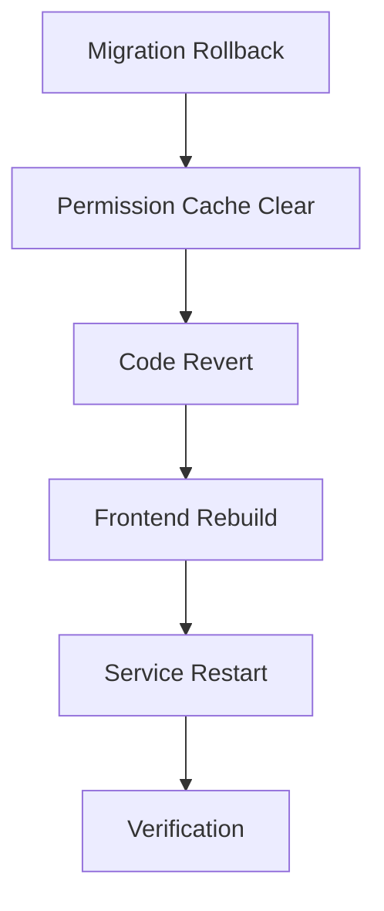

# RegionOperator Enhancement Rollback Plan

## 📋 Overview
This document outlines the complete rollback strategy for RegionOperator role enhancement changes.

## 🔄 Rollback Scenarios

### Scenario 1: Immediate Rollback (Before Production Use)
**Condition:** No RegionOperator users have been created yet
**Risk Level:** ✅ LOW
**Estimated Downtime:** 2-5 minutes

#### Steps:
```bash
# 1. Rollback migration
php artisan migrate:rollback --step=1

# 2. Clear caches
php artisan cache:clear
php artisan permission:cache-reset
php artisan config:clear

# 3. Revert code via Git
git revert <commit-hash> --no-edit

# 4. Frontend rebuild
cd ../frontend && npm run build
```

---

### Scenario 2: Partial Rollback (After Production Use)
**Condition:** RegionOperator users exist but having issues
**Risk Level:** ⚠️ MEDIUM
**Estimated Downtime:** 10-15 minutes

#### Prerequisites:
```bash
# Backup database first
php artisan db:backup

# Check affected users
php artisan tinker
>>> App\Models\User::whereHas('roles', fn($q) => $q->where('name', 'regionoperator'))->count();
```

#### Steps:

1. **Put system in maintenance mode**
```bash
php artisan down --message="System maintenance in progress"
```

2. **Preserve RegionOperator permissions data (optional)**
```sql
-- Export permissions before rollback
SELECT * FROM region_operator_permissions INTO OUTFILE '/tmp/ro_permissions_backup.csv';
```

3. **Rollback migration**
```bash
php artisan migrate:rollback --step=2
# This will rollback:
# - 2025_10_24_100000_create_region_operator_permissions_table.php
# - 2025_10_23_120050_add_missing_position_fields_to_user_profiles.php
```

4. **Update existing RegionOperator users (make department optional again)**
```bash
php artisan tinker
```

```php
// Remove department requirement validation temporarily
DB::table('users')
    ->whereHas('roles', function($q) {
        $q->where('name', 'regionoperator');
    })
    ->update(['updated_at' => now()]);
```

5. **Clear all caches**
```bash
php artisan cache:clear
php artisan permission:cache-reset
php artisan config:clear
php artisan route:clear
php artisan view:clear
```

6. **Restore old code**
```bash
# Restore backend files
git checkout <previous-commit-hash> backend/app/Http/Controllers/RegionOperator/
git checkout <previous-commit-hash> backend/app/Services/RegionOperator/
git checkout <previous-commit-hash> backend/app/Http/Controllers/RegionAdmin/RegionAdminUserController.php

# Restore frontend files
git checkout <previous-commit-hash> frontend/src/components/regionoperator/
git checkout <previous-commit-hash> frontend/src/pages/IndexOptimized.tsx
git checkout <previous-commit-hash> frontend/src/utils/roleUtils.ts
```

7. **Frontend rebuild**
```bash
cd ../frontend
npm run build
```

8. **Bring system back online**
```bash
php artisan up
```

9. **Verification**
```bash
# Check application health
curl http://localhost:8000/api/health

# Check RegionOperator login
# Manually test with test credentials
```

---

### Scenario 3: Data Preservation Rollback
**Condition:** Need to rollback but preserve all data
**Risk Level:** 🔴 HIGH
**Estimated Downtime:** 30-60 minutes

#### Steps:

1. **Full database backup**
```bash
# PostgreSQL
pg_dump -U atis_user -d atis_production > backup_$(date +%Y%m%d_%H%M%S).sql

# Or use Laravel backup
php artisan backup:run
```

2. **Export critical data**
```sql
-- Export RegionOperator users
COPY (
    SELECT u.id, u.username, u.email, u.institution_id, u.department_id,
           rop.can_manage_surveys, rop.can_manage_tasks,
           rop.can_manage_documents, rop.can_manage_folders, rop.can_manage_links
    FROM users u
    LEFT JOIN region_operator_permissions rop ON u.id = rop.user_id
    WHERE u.id IN (SELECT model_id FROM model_has_roles WHERE role_id = (SELECT id FROM roles WHERE name = 'regionoperator'))
) TO '/tmp/regionoperator_data_backup.csv' WITH CSV HEADER;
```

3. **Create restoration script**
```bash
# Save as: restore_regionoperator_data.php
cat > /tmp/restore_regionoperator_data.php << 'EOF'
<?php
require __DIR__.'/../vendor/autoload.php';
$app = require_once __DIR__.'/../bootstrap/app.php';
$app->make(Kernel::class)->bootstrap();

use App\Models\User;
use Illuminate\Support\Facades\DB;

$csv = array_map('str_getcsv', file('/tmp/regionoperator_data_backup.csv'));
$headers = array_shift($csv);

foreach ($csv as $row) {
    $data = array_combine($headers, $row);

    $user = User::find($data['id']);
    if ($user) {
        $user->update([
            'department_id' => $data['department_id'] ?: null,
        ]);

        // Store permissions in user meta or session for later restoration
        \Log::info('RegionOperator data preserved', [
            'user_id' => $user->id,
            'permissions' => array_filter($data, fn($k) => str_starts_with($k, 'can_'), ARRAY_FILTER_USE_KEY)
        ]);
    }
}

echo "Data preservation complete\n";
EOF

php /tmp/restore_regionoperator_data.php
```

4. **Execute rollback** (follow Scenario 2 steps)

5. **Post-rollback verification**
```bash
php artisan tinker
```

```php
// Verify all RegionOperator users are accessible
$operators = User::whereHas('roles', fn($q) => $q->where('name', 'regionoperator'))->get();
foreach ($operators as $op) {
    echo "User: {$op->username} | Institution: {$op->institution_id} | Department: {$op->department_id}\n";
}
```

---

## 🔍 Post-Rollback Verification Checklist

### Backend Verification
- [ ] Database migration status: `php artisan migrate:status`
- [ ] No orphan records: `SELECT * FROM region_operator_permissions;` (should return empty or error)
- [ ] RegionOperator users accessible: Test login with test credentials
- [ ] API endpoints functional: Test `/api/regionoperator/dashboard`
- [ ] No PHP errors: Check `storage/logs/laravel.log`

### Frontend Verification
- [ ] RegionOperator routing works: Navigate to dashboard
- [ ] No console errors: Check browser console
- [ ] User modal works: Create new RegionOperator (should not require department)
- [ ] Navigation functional: Check sidebar menu items

### Integration Tests
```bash
# Run test suite
php artisan test --filter=RegionalAccessControlTest
php artisan test --filter=RegionOperatorDashboardTest
```

---

## 🚨 Emergency Rollback (Production Crisis)

**Use this only if production is completely broken**

```bash
#!/bin/bash
# emergency_rollback.sh

echo "🚨 EMERGENCY ROLLBACK INITIATED"

# 1. Immediate maintenance mode
php artisan down --message="Emergency maintenance"

# 2. Quick database rollback
php artisan migrate:rollback --force

# 3. Git hard reset
git reset --hard <last-stable-commit>

# 4. Aggressive cache clear
rm -rf bootstrap/cache/*.php
php artisan cache:clear
php artisan config:clear
php artisan route:clear
php artisan view:clear

# 5. Frontend emergency rebuild
cd ../frontend
npm run build

# 6. Restart services
cd ../backend
php artisan queue:restart
php artisan schedule:clear-cache

# 7. Bring back online
php artisan up

echo "✅ Emergency rollback complete"
echo "⚠️  Manual verification required"
```

---

## 📊 Rollback Impact Assessment

### Database Impact
| Table | Action | Risk | Recovery |
|-------|--------|------|----------|
| `region_operator_permissions` | DROP | Low | Data lost (can be recreated) |
| `users` | No change | None | Fully preserved |
| `departments` | No change | None | Fully preserved |
| `permissions` | Revert 2 entries | Low | Re-seed after rollback |

### Code Impact
| Component | Lines Changed | Rollback Complexity | Dependencies |
|-----------|---------------|---------------------|--------------|
| Backend Controllers | ~250 | Medium | Service layer |
| Backend Services | ~574 | Low | Independent |
| Backend Models | ~50 | Low | Migration dependent |
| Frontend Components | ~800 | Medium | Routing changes |
| Frontend Services | ~260 | Low | API endpoints |

---

## 🔗 Rollback Dependencies



---

## 📞 Support Contacts

**Development Team:**
- Lead Developer: [contact]
- Database Admin: [contact]
- DevOps Engineer: [contact]

**Rollback Decision Authority:**
- Technical Lead: [contact]
- Product Owner: [contact]

---

## 📝 Rollback Incident Report Template

```markdown
# Rollback Incident Report

**Date:** YYYY-MM-DD HH:MM
**Triggered By:** [Name]
**Reason:** [Brief description]

## Timeline
- **HH:MM** - Issue detected
- **HH:MM** - Rollback initiated
- **HH:MM** - Maintenance mode enabled
- **HH:MM** - Migration rolled back
- **HH:MM** - Code reverted
- **HH:MM** - System restored
- **HH:MM** - Verification complete

## Impact
- **Users Affected:** [Number]
- **Downtime:** [Minutes]
- **Data Loss:** [Yes/No - Description]

## Root Cause
[Detailed explanation]

## Preventive Measures
[Actions to prevent recurrence]

## Lessons Learned
[Key takeaways]
```

---

## ✅ Rollback Success Criteria

1. ✅ All RegionOperator users can login
2. ✅ Dashboard loads without errors
3. ✅ No database migration errors
4. ✅ No console errors in frontend
5. ✅ API endpoints return expected data
6. ✅ User creation works (without department requirement)
7. ✅ No orphan database records
8. ✅ All tests pass

---

**Document Version:** 1.0
**Last Updated:** 2025-11-03
**Review Date:** Before each rollback execution
