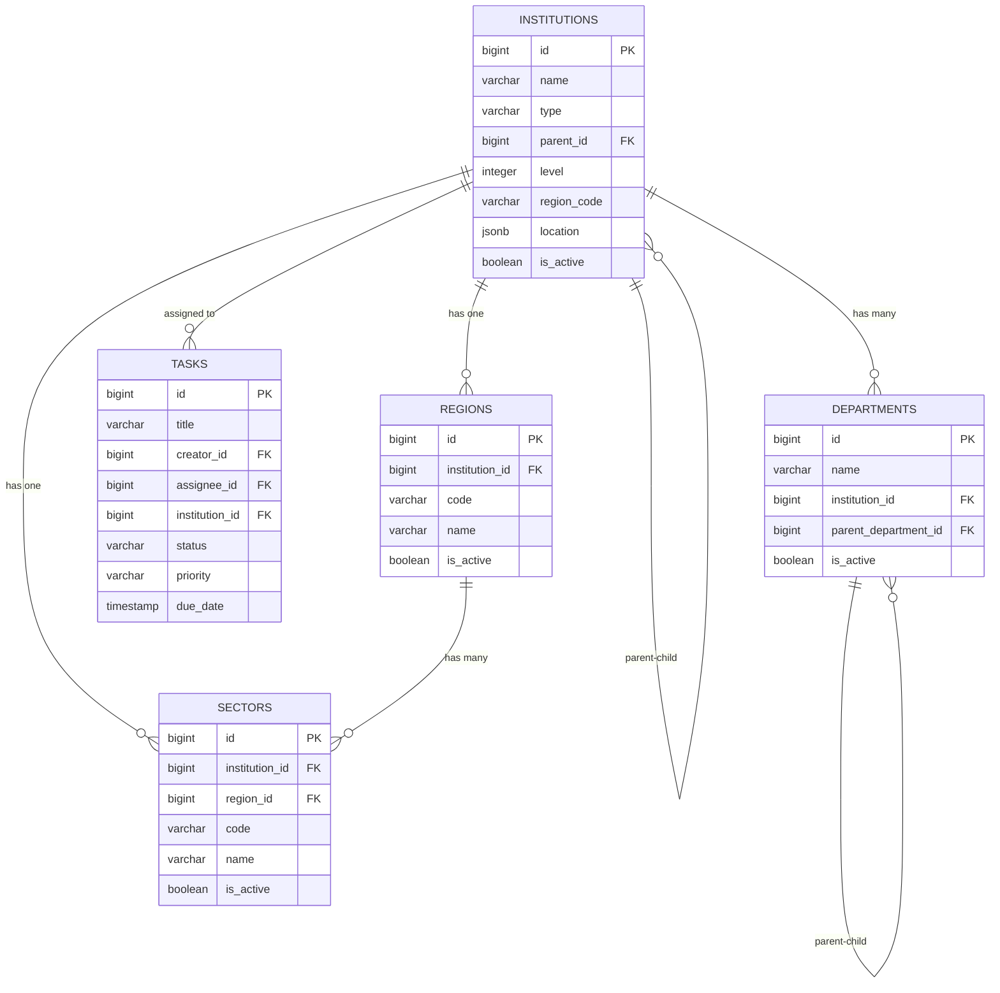

# DB-3: İdarəetmə Strukturu Cədvəlləri
## Azərbaycan Təhsil İdarəetmə Sistemi (ATİS)

### DOCUMENT INFO
**Version**: 2.1
**Created**: İyul 2025
**Category**: İdarəetmə Strukturu
**Technology**: PostgreSQL 15+ with Laravel 11 Migrations

---

## 1. İNSTİTUSİYA İDARƏETMƏ SİSTEMİ

### 1.1 İnstitusiya Cədvəli (institutions)

```sql
CREATE TABLE institutions (
    id BIGSERIAL PRIMARY KEY,
    name VARCHAR(200) NOT NULL,
    short_name VARCHAR(50),
    type VARCHAR(50) NOT NULL, -- 'region', 'sektor', 'school', etc.
    parent_id BIGINT,
    level INTEGER NOT NULL, -- 1=Ministry, 2=Region, 3=Sektor, 4=School
    region_code VARCHAR(10),
    institution_code VARCHAR(20) UNIQUE,
    contact_info JSONB DEFAULT '{}'::jsonb,
    location JSONB DEFAULT '{}'::jsonb,
    metadata JSONB DEFAULT '{}'::jsonb,
    is_active BOOLEAN DEFAULT true,
    established_date DATE,
    created_at TIMESTAMP DEFAULT NOW(),
    updated_at TIMESTAMP DEFAULT NOW(),
    
    -- Constraints
    CONSTRAINT institutions_parent_id_fkey FOREIGN KEY (parent_id) REFERENCES institutions(id),
    CONSTRAINT institutions_level_range CHECK (level BETWEEN 1 AND 5),
    CONSTRAINT institutions_type_check CHECK (type IN ('ministry', 'region', 'sektor', 'school', 'vocational', 'university'))
);

CREATE INDEX idx_institutions_parent_id ON institutions(parent_id);
CREATE INDEX idx_institutions_type_level ON institutions(type, level);
CREATE INDEX idx_institutions_region_code ON institutions(region_code);
CREATE INDEX idx_institutions_active ON institutions(is_active);
CREATE INDEX idx_institutions_location_gin ON institutions USING GIN(location);
CREATE INDEX idx_institutions_metadata_gin ON institutions USING GIN(metadata);
```

**Sütun Təsvirləri**:

| Sütun            | Növ          | Təsvir                                     |
|------------------|--------------|-------------------------------------------|
| id               | BIGSERIAL    | Unikal identifikator                      |
| name             | VARCHAR(200) | Təşkilatın tam adı                        |
| short_name       | VARCHAR(50)  | Qısa adı (abbreviation)                  |
| type             | VARCHAR(50)  | Təşkilat tipi (region, sektor, məktəb)    |
| parent_id        | BIGINT       | Yuxarı təşkilat ID                        |
| level            | INTEGER      | İerarxiya səviyyəsi                       |
| region_code      | VARCHAR(10)  | Regional kod                              |
| institution_code | VARCHAR(20)  | Təşkilat kodu (statistika üçün)           |
| contact_info     | JSONB        | Əlaqə məlumatları                         |
| location         | JSONB        | Coğrafi məlumatlar                        |
| metadata         | JSONB        | Əlavə meta məlumatlar                     |
| is_active        | BOOLEAN      | Aktivlik statusu                          |
| established_date | DATE         | Yaranma tarixi                            |
| created_at       | TIMESTAMP    | Sistemdə yaranma vaxtı                    |
| updated_at       | TIMESTAMP    | Son yenilənmə vaxtı                       |

### 1.2 Şöbələr (departments)

```sql
CREATE TABLE departments (
    id BIGSERIAL PRIMARY KEY,
    name VARCHAR(100) NOT NULL,
    short_name VARCHAR(20),
    institution_id BIGINT NOT NULL,
    parent_department_id BIGINT,
    description TEXT,
    is_active BOOLEAN DEFAULT true,
    created_at TIMESTAMP DEFAULT NOW(),
    updated_at TIMESTAMP DEFAULT NOW(),
    
    -- Constraints
    CONSTRAINT departments_institution_id_fkey FOREIGN KEY (institution_id) REFERENCES institutions(id) ON DELETE CASCADE,
    CONSTRAINT departments_parent_department_id_fkey FOREIGN KEY (parent_department_id) REFERENCES departments(id) ON DELETE CASCADE
);

CREATE INDEX idx_departments_institution ON departments(institution_id);
CREATE INDEX idx_departments_parent ON departments(parent_department_id);
```

---

## 2. REGİON VƏ SEKTOR İDARƏETMƏSİ

### 2.1 Regionlar (regions)

```sql
CREATE TABLE regions (
    id BIGSERIAL PRIMARY KEY,
    institution_id BIGINT NOT NULL UNIQUE,
    code VARCHAR(10) UNIQUE NOT NULL,
    name VARCHAR(100) NOT NULL,
    area_km2 DECIMAL(10, 2),
    population INTEGER,
    metadata JSONB DEFAULT '{}'::jsonb,
    is_active BOOLEAN DEFAULT true,
    created_at TIMESTAMP DEFAULT NOW(),
    updated_at TIMESTAMP DEFAULT NOW(),
    
    -- Constraints
    CONSTRAINT regions_institution_id_fkey FOREIGN KEY (institution_id) REFERENCES institutions(id) ON DELETE CASCADE
);

CREATE INDEX idx_regions_code ON regions(code);
```

### 2.2 Sektorlar (sectors)

```sql
CREATE TABLE sectors (
    id BIGSERIAL PRIMARY KEY,
    institution_id BIGINT NOT NULL UNIQUE,
    region_id BIGINT NOT NULL,
    code VARCHAR(10) UNIQUE NOT NULL,
    name VARCHAR(100) NOT NULL,
    area_km2 DECIMAL(10, 2),
    population INTEGER,
    metadata JSONB DEFAULT '{}'::jsonb,
    is_active BOOLEAN DEFAULT true,
    created_at TIMESTAMP DEFAULT NOW(),
    updated_at TIMESTAMP DEFAULT NOW(),
    
    -- Constraints
    CONSTRAINT sectors_institution_id_fkey FOREIGN KEY (institution_id) REFERENCES institutions(id) ON DELETE CASCADE,
    CONSTRAINT sectors_region_id_fkey FOREIGN KEY (region_id) REFERENCES regions(id) ON DELETE CASCADE
);

CREATE INDEX idx_sectors_region_id ON sectors(region_id);
CREATE INDEX idx_sectors_code ON sectors(code);
```

---

## 3. TAPŞIRIQ VƏ İŞ BÖLÜŞMƏSİ

### 3.1 Tapşırıqlar (tasks)

```sql
CREATE TABLE tasks (
    id BIGSERIAL PRIMARY KEY,
    title VARCHAR(200) NOT NULL,
    description TEXT,
    creator_id BIGINT NOT NULL,
    assignee_id BIGINT,
    institution_id BIGINT, -- Assigned to entire institution
    status VARCHAR(50) NOT NULL, -- 'pending', 'in_progress', 'completed', 'rejected'
    priority VARCHAR(20) NOT NULL, -- 'low', 'medium', 'high', 'urgent'
    due_date TIMESTAMP,
    start_date TIMESTAMP,
    completion_date TIMESTAMP,
    category VARCHAR(100),
    tags JSONB DEFAULT '[]'::jsonb,
    attachments JSONB DEFAULT '[]'::jsonb,
    metadata JSONB DEFAULT '{}'::jsonb,
    parent_task_id BIGINT,
    created_at TIMESTAMP DEFAULT NOW(),
    updated_at TIMESTAMP DEFAULT NOW(),
    
    -- Constraints
    CONSTRAINT tasks_creator_id_fkey FOREIGN KEY (creator_id) REFERENCES users(id),
    CONSTRAINT tasks_assignee_id_fkey FOREIGN KEY (assignee_id) REFERENCES users(id),
    CONSTRAINT tasks_institution_id_fkey FOREIGN KEY (institution_id) REFERENCES institutions(id),
    CONSTRAINT tasks_parent_task_id_fkey FOREIGN KEY (parent_task_id) REFERENCES tasks(id),
    CONSTRAINT tasks_status_check CHECK (status IN ('pending', 'in_progress', 'completed', 'rejected', 'on_hold')),
    CONSTRAINT tasks_priority_check CHECK (priority IN ('low', 'medium', 'high', 'urgent'))
);

CREATE INDEX idx_tasks_creator ON tasks(creator_id);
CREATE INDEX idx_tasks_assignee ON tasks(assignee_id);
CREATE INDEX idx_tasks_institution ON tasks(institution_id);
CREATE INDEX idx_tasks_parent ON tasks(parent_task_id);
CREATE INDEX idx_tasks_status_priority ON tasks(status, priority);
CREATE INDEX idx_tasks_due_date ON tasks(due_date);
CREATE INDEX idx_tasks_tags ON tasks USING GIN(tags);
```

### 3.2 Tapşırıq Tarixçəsi (task_history)

```sql
CREATE TABLE task_history (
    id BIGSERIAL PRIMARY KEY,
    task_id BIGINT NOT NULL,
    user_id BIGINT NOT NULL,
    action VARCHAR(50) NOT NULL, -- 'created', 'updated', 'assigned', 'status_changed'
    old_values JSONB,
    new_values JSONB,
    comment TEXT,
    created_at TIMESTAMP DEFAULT NOW(),
    
    -- Constraints
    CONSTRAINT task_history_task_id_fkey FOREIGN KEY (task_id) REFERENCES tasks(id) ON DELETE CASCADE,
    CONSTRAINT task_history_user_id_fkey FOREIGN KEY (user_id) REFERENCES users(id) ON DELETE CASCADE
);

CREATE INDEX idx_task_history_task ON task_history(task_id);
CREATE INDEX idx_task_history_user ON task_history(user_id);
CREATE INDEX idx_task_history_action ON task_history(action);
```

### 3.3 Tapşırıq Hədəfləri (task_targets)

```sql
CREATE TABLE task_targets (
    id BIGSERIAL PRIMARY KEY,
    task_id BIGINT NOT NULL,
    institution_id BIGINT NOT NULL,
    status VARCHAR(50) NOT NULL DEFAULT 'pending',
    assigned_user_id BIGINT,
    response JSONB DEFAULT '{}'::jsonb,
    completed_at TIMESTAMP,
    created_at TIMESTAMP DEFAULT NOW(),
    updated_at TIMESTAMP DEFAULT NOW(),
    
    -- Constraints
    CONSTRAINT task_targets_task_id_fkey FOREIGN KEY (task_id) REFERENCES tasks(id) ON DELETE CASCADE,
    CONSTRAINT task_targets_institution_id_fkey FOREIGN KEY (institution_id) REFERENCES institutions(id) ON DELETE CASCADE,
    CONSTRAINT task_targets_assigned_user_id_fkey FOREIGN KEY (assigned_user_id) REFERENCES users(id) ON DELETE SET NULL,
    CONSTRAINT task_targets_unique UNIQUE (task_id, institution_id)
);

CREATE INDEX idx_task_targets_task ON task_targets(task_id);
CREATE INDEX idx_task_targets_institution ON task_targets(institution_id);
CREATE INDEX idx_task_targets_status ON task_targets(status);
```

---

## 4. İNSTİTUSİYA MATERİALLARI

### 4.1 Sənəd Anbarı (documents)

```sql
CREATE TABLE documents (
    id BIGSERIAL PRIMARY KEY,
    title VARCHAR(255) NOT NULL,
    description TEXT,
    file_path VARCHAR(255) NOT NULL,
    file_type VARCHAR(50) NOT NULL,
    file_size INTEGER NOT NULL, -- bytes
    owner_id BIGINT NOT NULL,
    institution_id BIGINT NOT NULL,
    is_public BOOLEAN DEFAULT false,
    visibility_level INTEGER DEFAULT 0, -- 0=private, 1=institution, 2=parent, 3=all
    category VARCHAR(100),
    tags JSONB DEFAULT '[]'::jsonb,
    metadata JSONB DEFAULT '{}'::jsonb,
    created_at TIMESTAMP DEFAULT NOW(),
    updated_at TIMESTAMP DEFAULT NOW(),
    
    -- Constraints
    CONSTRAINT documents_owner_id_fkey FOREIGN KEY (owner_id) REFERENCES users(id),
    CONSTRAINT documents_institution_id_fkey FOREIGN KEY (institution_id) REFERENCES institutions(id)
);

CREATE INDEX idx_documents_owner ON documents(owner_id);
CREATE INDEX idx_documents_institution ON documents(institution_id);
CREATE INDEX idx_documents_visibility ON documents(visibility_level);
CREATE INDEX idx_documents_category ON documents(category);
CREATE INDEX idx_documents_tags ON documents USING GIN(tags);
```

### 4.2 Linklər və Əlavə Mənbələr (resources)

```sql
CREATE TABLE resources (
    id BIGSERIAL PRIMARY KEY,
    title VARCHAR(255) NOT NULL,
    url VARCHAR(2048) NOT NULL,
    description TEXT,
    resource_type VARCHAR(50) NOT NULL, -- 'link', 'video', 'article', etc.
    owner_id BIGINT NOT NULL,
    institution_id BIGINT NOT NULL,
    is_public BOOLEAN DEFAULT false,
    visibility_level INTEGER DEFAULT 0,
    category VARCHAR(100),
    tags JSONB DEFAULT '[]'::jsonb,
    metadata JSONB DEFAULT '{}'::jsonb,
    created_at TIMESTAMP DEFAULT NOW(),
    updated_at TIMESTAMP DEFAULT NOW(),
    
    -- Constraints
    CONSTRAINT resources_owner_id_fkey FOREIGN KEY (owner_id) REFERENCES users(id),
    CONSTRAINT resources_institution_id_fkey FOREIGN KEY (institution_id) REFERENCES institutions(id)
);

CREATE INDEX idx_resources_owner ON resources(owner_id);
CREATE INDEX idx_resources_institution ON resources(institution_id);
CREATE INDEX idx_resources_visibility ON resources(visibility_level);
CREATE INDEX idx_resources_category ON resources(category);
CREATE INDEX idx_resources_tags ON resources USING GIN(tags);
```

---

## 5. ƏLAQƏLƏNDİRMƏ DİAQRAMI


