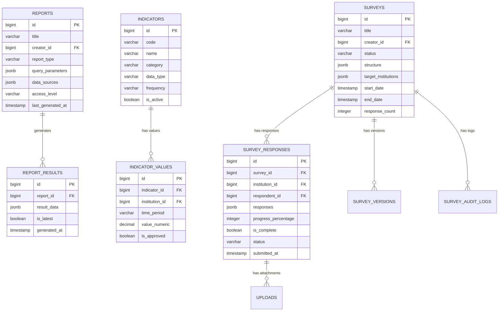

# DB-4: Məlumat Toplama və Sorğu Cədvəlləri
## Azərbaycan Təhsil İdarəetmə Sistemi (ATİS)

### DOCUMENT INFO
**Version**: 2.1
**Created**: İyul 2025
**Category**: Məlumat Toplama və Statistika
**Technology**: PostgreSQL 15+ with Laravel 11 Migrations

---

## 1. SORĞU SİSTEMİ

### 1.1 Sorğular (surveys)

```sql
CREATE TABLE surveys (
    id BIGSERIAL PRIMARY KEY,
    title VARCHAR(255) NOT NULL,
    description TEXT,
    creator_id BIGINT NOT NULL,
    status VARCHAR(50) NOT NULL DEFAULT 'draft', -- 'draft', 'published', 'closed', 'archived'
    survey_type VARCHAR(50) NOT NULL, -- 'form', 'poll', 'assessment', 'feedback'
    is_anonymous BOOLEAN DEFAULT false,
    allow_multiple_responses BOOLEAN DEFAULT false,
    structure JSONB NOT NULL, -- Survey questions and structure
    target_institutions JSONB NOT NULL, -- Target institutions array
    target_departments JSONB DEFAULT '[]'::jsonb, -- Target departments if applicable
    start_date TIMESTAMP,
    end_date TIMESTAMP,
    published_at TIMESTAMP,
    archived_at TIMESTAMP,
    response_count INTEGER DEFAULT 0,
    completion_threshold INTEGER, -- percentage required for completion
    metadata JSONB DEFAULT '{}'::jsonb,
    created_at TIMESTAMP DEFAULT NOW(),
    updated_at TIMESTAMP DEFAULT NOW(),
    
    -- Constraints
    CONSTRAINT surveys_creator_id_fkey FOREIGN KEY (creator_id) REFERENCES users(id),
    CONSTRAINT surveys_status_check CHECK (status IN ('draft', 'published', 'closed', 'archived')),
    CONSTRAINT surveys_dates_check CHECK (end_date > start_date)
);

CREATE INDEX idx_surveys_creator ON surveys(creator_id);
CREATE INDEX idx_surveys_status ON surveys(status);
CREATE INDEX idx_surveys_dates ON surveys(start_date, end_date);
CREATE INDEX idx_surveys_type ON surveys(survey_type);
CREATE INDEX idx_surveys_targets ON surveys USING GIN(target_institutions);
```

**Sütun Təsvirləri**:

| Sütun                    | Növ          | Təsvir                                      |
|--------------------------|--------------|---------------------------------------------|
| id                       | BIGSERIAL    | Unikal identifikator                        |
| title                    | VARCHAR(255) | Sorğu başlığı                               |
| description              | TEXT         | Ətraflı təsvir                              |
| creator_id               | BIGINT       | Yaradan istifadəçi                          |
| status                   | VARCHAR(50)  | Sorğu statusu                               |
| survey_type              | VARCHAR(50)  | Sorğu tipi                                  |
| is_anonymous             | BOOLEAN      | Anonim cavablar                             |
| allow_multiple_responses | BOOLEAN      | Təkrar cavablar                             |
| structure                | JSONB        | Sorğu sualları və strukturu                 |
| target_institutions      | JSONB        | Hədəf təşkilatlar                           |
| target_departments       | JSONB        | Hədəf şöbələr                               |
| start_date               | TIMESTAMP    | Başlama tarixi                              |
| end_date                 | TIMESTAMP    | Bitmə tarixi                                |
| published_at             | TIMESTAMP    | Nəşr olunma tarixi                          |
| archived_at              | TIMESTAMP    | Arxivləmə tarixi                            |
| response_count           | INTEGER      | Cavab sayı                                  |
| completion_threshold     | INTEGER      | Tamamlanma faizi                            |
| metadata                 | JSONB        | Əlavə meta məlumatlar                       |

**Structure JSONB Format Example**:
```json
{
  "sections": [
    {
      "id": "section1",
      "title": "Ümumi Məlumatlar",
      "description": "Təhsil müəssisəsi haqqında əsas məlumatlar",
      "questions": [
        {
          "id": "q1",
          "question": "Məktəbinizdə neçə şagird təhsil alır?",
          "type": "number",
          "required": true,
          "validation": {
            "min": 1,
            "max": 5000
          }
        },
        {
          "id": "q2",
          "question": "Hansı təhsil proqramları təklif olunur?",
          "type": "checkbox",
          "options": [
            "Ümumi təhsil",
            "İbtidai təhsil",
            "Əsas təhsil",
            "Orta təhsil",
            "Texniki-peşə təhsili"
          ],
          "required": true
        }
      ]
    }
  ],
  "logic": [
    {
      "if": {
        "question": "q2",
        "contains": "Texniki-peşə təhsili"
      },
      "then": {
        "show_section": "section_vocational"
      }
    }
  ],
  "settings": {
    "allow_save_and_continue": true,
    "show_progress_bar": true,
    "randomize_questions": false
  }
}
```

### 1.2 Sorğu Cavabları (survey_responses)

```sql
CREATE TABLE survey_responses (
    id BIGSERIAL PRIMARY KEY,
    survey_id BIGINT NOT NULL,
    institution_id BIGINT NOT NULL,
    department_id BIGINT,
    respondent_id BIGINT,
    respondent_role VARCHAR(50),
    responses JSONB NOT NULL,
    progress_percentage INTEGER DEFAULT 0,
    is_complete BOOLEAN DEFAULT false,
    ip_address VARCHAR(45),
    user_agent TEXT,
    started_at TIMESTAMP,
    submitted_at TIMESTAMP,
    approved_by BIGINT,
    approved_at TIMESTAMP,
    status VARCHAR(20) DEFAULT 'draft', -- 'draft', 'submitted', 'approved', 'rejected'
    rejection_reason TEXT,
    metadata JSONB DEFAULT '{}'::jsonb,
    created_at TIMESTAMP DEFAULT NOW(),
    updated_at TIMESTAMP DEFAULT NOW(),
    
    -- Constraints
    CONSTRAINT survey_responses_survey_id_fkey FOREIGN KEY (survey_id) REFERENCES surveys(id) ON DELETE CASCADE,
    CONSTRAINT survey_responses_institution_id_fkey FOREIGN KEY (institution_id) REFERENCES institutions(id),
    CONSTRAINT survey_responses_department_id_fkey FOREIGN KEY (department_id) REFERENCES departments(id),
    CONSTRAINT survey_responses_respondent_id_fkey FOREIGN KEY (respondent_id) REFERENCES users(id),
    CONSTRAINT survey_responses_approved_by_fkey FOREIGN KEY (approved_by) REFERENCES users(id),
    CONSTRAINT survey_responses_status_check CHECK (status IN ('draft', 'submitted', 'approved', 'rejected')),
    CONSTRAINT survey_responses_progress_check CHECK (progress_percentage BETWEEN 0 AND 100)
);

CREATE INDEX idx_survey_responses_survey ON survey_responses(survey_id);
CREATE INDEX idx_survey_responses_institution ON survey_responses(institution_id);
CREATE INDEX idx_survey_responses_respondent ON survey_responses(respondent_id);
CREATE INDEX idx_survey_responses_status ON survey_responses(status);
CREATE INDEX idx_survey_responses_dates ON survey_responses(submitted_at);
CREATE INDEX idx_survey_responses_data ON survey_responses USING GIN(responses);
```

**Responses JSONB Format Example**:
```json
{
  "q1": 850,
  "q2": ["Ümumi təhsil", "İbtidai təhsil", "Əsas təhsil", "Orta təhsil"],
  "q3": {
    "latitude": 40.409264,
    "longitude": 49.867092
  },
  "q4": {
    "answer": "Məktəbimiz 1998-ci ildə əsası qoyulmuşdur...",
    "attachment_id": 12345
  },
  "q5": [
    {
      "name": "Fizika kabinetləri",
      "count": 2,
      "condition": "good"
    },
    {
      "name": "Kimya laboratoriyaları",
      "count": 1,
      "condition": "excellent"
    }
  ],
  "section_timestamps": {
    "section1": "2025-04-12T14:22:00Z",
    "section2": "2025-04-12T14:35:00Z"
  }
}
```

### 1.3 Sorğu Versiyaları (survey_versions)

```sql
CREATE TABLE survey_versions (
    id BIGSERIAL PRIMARY KEY,
    survey_id BIGINT NOT NULL,
    version_number INTEGER NOT NULL,
    structure JSONB NOT NULL,
    created_by BIGINT NOT NULL,
    created_at TIMESTAMP DEFAULT NOW(),
    
    -- Constraints
    CONSTRAINT survey_versions_survey_id_fkey FOREIGN KEY (survey_id) REFERENCES surveys(id) ON DELETE CASCADE,
    CONSTRAINT survey_versions_created_by_fkey FOREIGN KEY (created_by) REFERENCES users(id),
    CONSTRAINT survey_versions_unique UNIQUE (survey_id, version_number)
);

CREATE INDEX idx_survey_versions_survey ON survey_versions(survey_id, version_number);
```

### 1.4 Sorğu Audit Jurnalı (survey_audit_logs)

```sql
CREATE TABLE survey_audit_logs (
    id BIGSERIAL PRIMARY KEY,
    survey_id BIGINT NOT NULL,
    response_id BIGINT,
    user_id BIGINT,
    action VARCHAR(50) NOT NULL, -- 'created', 'published', 'responded', 'approved', etc.
    details JSONB,
    ip_address VARCHAR(45),
    created_at TIMESTAMP DEFAULT NOW(),
    
    -- Constraints
    CONSTRAINT survey_audit_logs_survey_id_fkey FOREIGN KEY (survey_id) REFERENCES surveys(id) ON DELETE CASCADE,
    CONSTRAINT survey_audit_logs_response_id_fkey FOREIGN KEY (response_id) REFERENCES survey_responses(id) ON DELETE SET NULL,
    CONSTRAINT survey_audit_logs_user_id_fkey FOREIGN KEY (user_id) REFERENCES users(id) ON DELETE SET NULL
);

CREATE INDEX idx_survey_audit_logs_survey ON survey_audit_logs(survey_id);
CREATE INDEX idx_survey_audit_logs_action ON survey_audit_logs(action);
CREATE INDEX idx_survey_audit_logs_date ON survey_audit_logs(created_at);
```

---

## 2. HESABAT SİSTEMİ

### 2.1 Hesabatlar (reports)

```sql
CREATE TABLE reports (
    id BIGSERIAL PRIMARY KEY,
    title VARCHAR(255) NOT NULL,
    description TEXT,
    creator_id BIGINT NOT NULL,
    report_type VARCHAR(50) NOT NULL, -- 'survey_analysis', 'academic_performance', etc.
    query_parameters JSONB NOT NULL, -- Filter and parameters for generating the report
    data_sources JSONB NOT NULL, -- Reference to source data
    visualization_config JSONB, -- Chart and visual configuration
    access_level VARCHAR(20) NOT NULL DEFAULT 'private', -- 'private', 'institution', 'department', 'public'
    format VARCHAR(20) DEFAULT 'web', -- 'web', 'pdf', 'excel', 'api'
    schedule VARCHAR(100), -- Cron expression for scheduled reports
    last_generated_at TIMESTAMP,
    expiration_date TIMESTAMP,
    is_featured BOOLEAN DEFAULT false,
    metadata JSONB DEFAULT '{}'::jsonb,
    created_at TIMESTAMP DEFAULT NOW(),
    updated_at TIMESTAMP DEFAULT NOW(),
    
    -- Constraints
    CONSTRAINT reports_creator_id_fkey FOREIGN KEY (creator_id) REFERENCES users(id),
    CONSTRAINT reports_access_level_check CHECK (access_level IN ('private', 'institution', 'department', 'public')),
    CONSTRAINT reports_format_check CHECK (format IN ('web', 'pdf', 'excel', 'api'))
);

CREATE INDEX idx_reports_creator ON reports(creator_id);
CREATE INDEX idx_reports_type ON reports(report_type);
CREATE INDEX idx_reports_access ON reports(access_level);
CREATE INDEX idx_reports_generated ON reports(last_generated_at);
CREATE INDEX idx_reports_data_sources ON reports USING GIN(data_sources);
```

### 2.2 Hesabat Nəticələri (report_results)

```sql
CREATE TABLE report_results (
    id BIGSERIAL PRIMARY KEY,
    report_id BIGINT NOT NULL,
    result_data JSONB NOT NULL,
    file_path VARCHAR(255), -- For stored report files
    generation_duration INTEGER, -- milliseconds
    is_latest BOOLEAN DEFAULT true,
    metadata JSONB DEFAULT '{}'::jsonb,
    generated_at TIMESTAMP DEFAULT NOW(),
    
    -- Constraints
    CONSTRAINT report_results_report_id_fkey FOREIGN KEY (report_id) REFERENCES reports(id) ON DELETE CASCADE
);

CREATE INDEX idx_report_results_report ON report_results(report_id);
CREATE INDEX idx_report_results_latest ON report_results(report_id, is_latest);
CREATE INDEX idx_report_results_date ON report_results(generated_at);
```

### 2.3 Göstərici Tərifləri (indicators)

```sql
CREATE TABLE indicators (
    id BIGSERIAL PRIMARY KEY,
    code VARCHAR(50) UNIQUE NOT NULL,
    name VARCHAR(200) NOT NULL,
    description TEXT,
    category VARCHAR(100) NOT NULL,
    data_type VARCHAR(50) NOT NULL, -- 'integer', 'decimal', 'percentage', 'text', etc.
    unit VARCHAR(50), -- 'students', 'hours', 'points', etc.
    calculation_method TEXT,
    data_source VARCHAR(100),
    frequency VARCHAR(50), -- 'daily', 'monthly', 'quarterly', 'annual'
    benchmark JSONB, -- Benchmark values for comparison
    metadata JSONB DEFAULT '{}'::jsonb,
    is_active BOOLEAN DEFAULT true,
    created_at TIMESTAMP DEFAULT NOW(),
    updated_at TIMESTAMP DEFAULT NOW()
);

CREATE INDEX idx_indicators_code ON indicators(code);
CREATE INDEX idx_indicators_category ON indicators(category);
CREATE INDEX idx_indicators_active ON indicators(is_active);
```

### 2.4 Göstərici Məlumatları (indicator_values)

```sql
CREATE TABLE indicator_values (
    id BIGSERIAL PRIMARY KEY,
    indicator_id BIGINT NOT NULL,
    institution_id BIGINT NOT NULL,
    time_period VARCHAR(20) NOT NULL, -- '2025-04', '2025-Q2', '2025', etc.
    value_numeric DECIMAL(15, 5),
    value_text TEXT,
    source VARCHAR(100),
    is_estimated BOOLEAN DEFAULT false,
    is_approved BOOLEAN DEFAULT false,
    approved_by BIGINT,
    metadata JSONB DEFAULT '{}'::jsonb,
    created_at TIMESTAMP DEFAULT NOW(),
    updated_at TIMESTAMP DEFAULT NOW(),
    
    -- Constraints
    CONSTRAINT indicator_values_indicator_id_fkey FOREIGN KEY (indicator_id) REFERENCES indicators(id),
    CONSTRAINT indicator_values_institution_id_fkey FOREIGN KEY (institution_id) REFERENCES institutions(id),
    CONSTRAINT indicator_values_approved_by_fkey FOREIGN KEY (approved_by) REFERENCES users(id),
    CONSTRAINT indicator_values_unique UNIQUE (indicator_id, institution_id, time_period)
);

CREATE INDEX idx_indicator_values_indicator ON indicator_values(indicator_id);
CREATE INDEX idx_indicator_values_institution ON indicator_values(institution_id);
CREATE INDEX idx_indicator_values_period ON indicator_values(time_period);
CREATE INDEX idx_indicator_values_approved ON indicator_values(is_approved);
```

---

## 3. ƏLAVƏ MƏLUMAT TOPLAMA

### 3.1 Fayllar və Yükləmələr (uploads)

```sql
CREATE TABLE uploads (
    id BIGSERIAL PRIMARY KEY,
    user_id BIGINT NOT NULL,
    entity_type VARCHAR(50), -- 'survey_response', 'task', 'document', etc.
    entity_id BIGINT,
    original_filename VARCHAR(255) NOT NULL,
    stored_filename VARCHAR(255) NOT NULL,
    file_path VARCHAR(255) NOT NULL,
    file_type VARCHAR(100) NOT NULL,
    file_size INTEGER NOT NULL, -- bytes
    mime_type VARCHAR(100) NOT NULL,
    is_public BOOLEAN DEFAULT false,
    metadata JSONB DEFAULT '{}'::jsonb,
    created_at TIMESTAMP DEFAULT NOW(),
    
    -- Constraints
    CONSTRAINT uploads_user_id_fkey FOREIGN KEY (user_id) REFERENCES users(id)
);

CREATE INDEX idx_uploads_user ON uploads(user_id);
CREATE INDEX idx_uploads_entity ON uploads(entity_type, entity_id);
CREATE INDEX idx_uploads_file_type ON uploads(file_type);
```

### 3.2 Nəzarət Siyahıları (checklists)

```sql
CREATE TABLE checklists (
    id BIGSERIAL PRIMARY KEY,
    title VARCHAR(255) NOT NULL,
    description TEXT,
    creator_id BIGINT NOT NULL,
    institution_id BIGINT,
    items JSONB NOT NULL, -- Checklist items
    category VARCHAR(100),
    is_template BOOLEAN DEFAULT false,
    due_date TIMESTAMP,
    status VARCHAR(20) DEFAULT 'active', -- 'active', 'completed', 'archived'
    created_at TIMESTAMP DEFAULT NOW(),
    updated_at TIMESTAMP DEFAULT NOW(),
    
    -- Constraints
    CONSTRAINT checklists_creator_id_fkey FOREIGN KEY (creator_id) REFERENCES users(id),
    CONSTRAINT checklists_institution_id_fkey FOREIGN KEY (institution_id) REFERENCES institutions(id)
);

CREATE INDEX idx_checklists_creator ON checklists(creator_id);
CREATE INDEX idx_checklists_institution ON checklists(institution_id);
CREATE INDEX idx_checklists_status ON checklists(status);
CREATE INDEX idx_checklists_template ON checklists(is_template);
```

### 3.3 Statistik Məlumatlar (statistics)

```sql
CREATE TABLE statistics (
    id BIGSERIAL PRIMARY KEY,
    institution_id BIGINT NOT NULL,
    time_period VARCHAR(20) NOT NULL, -- '2025-04', '2025-Q2', '2025', etc.
    category VARCHAR(100) NOT NULL,
    data JSONB NOT NULL,
    source VARCHAR(100),
    is_verified BOOLEAN DEFAULT false,
    verified_by BIGINT,
    verified_at TIMESTAMP,
    created_at TIMESTAMP DEFAULT NOW(),
    updated_at TIMESTAMP DEFAULT NOW(),
    
    -- Constraints
    CONSTRAINT statistics_institution_id_fkey FOREIGN KEY (institution_id) REFERENCES institutions(id),
    CONSTRAINT statistics_verified_by_fkey FOREIGN KEY (verified_by) REFERENCES users(id),
    CONSTRAINT statistics_unique UNIQUE (institution_id, time_period, category)
);

CREATE INDEX idx_statistics_institution ON statistics(institution_id);
CREATE INDEX idx_statistics_period ON statistics(time_period);
CREATE INDEX idx_statistics_category ON statistics(category);
CREATE INDEX idx_statistics_verified ON statistics(is_verified);
```

---

## 4. ƏLAQƏLƏNDİRMƏ DİAQRAMI


