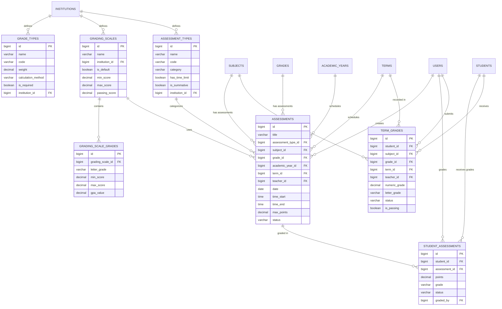

# DB-5C1: Məktəb Qiymətləndirmə Sistemi
## Azərbaycan Təhsil İdarəetmə Sistemi (ATİS)

### DOCUMENT INFO
**Version**: 2.1
**Created**: İyul 2025
**Category**: Məktəb İdarəetməsi - Qiymətləndirmə
**Technology**: PostgreSQL 15+ with Laravel 11 Migrations

---

## 1. QİYMƏTLƏNDİRMƏ SİSTEMİ

### 1.1 Qiymət Növləri (grade_types)

```sql
CREATE TABLE grade_types (
    id BIGSERIAL PRIMARY KEY,
    name VARCHAR(100) NOT NULL,
    code VARCHAR(20) NOT NULL,
    description TEXT,
    weight DECIMAL(5,2) DEFAULT 1.0,
    calculation_method VARCHAR(50) DEFAULT 'average', -- 'average', 'weighted', 'sum', 'custom'
    is_required BOOLEAN DEFAULT false,
    display_in_reports BOOLEAN DEFAULT true,
    institution_id BIGINT,
    is_system BOOLEAN DEFAULT false,
    custom_settings JSONB DEFAULT '{}'::jsonb,
    created_at TIMESTAMP DEFAULT NOW(),
    updated_at TIMESTAMP DEFAULT NOW(),
    
    -- Constraints
    CONSTRAINT grade_types_institution_id_fkey FOREIGN KEY (institution_id) REFERENCES institutions(id),
    CONSTRAINT grade_types_weight_check CHECK (weight > 0),
    CONSTRAINT grade_types_calculation_method_check CHECK (calculation_method IN ('average', 'weighted', 'sum', 'custom')),
    CONSTRAINT grade_types_name_institution_unique UNIQUE (name, institution_id)
);

CREATE INDEX idx_grade_types_institution ON grade_types(institution_id);
CREATE INDEX idx_grade_types_code ON grade_types(code);
CREATE INDEX idx_grade_types_is_system ON grade_types(is_system);
```

### 1.2 Qiymət Şkalaları (grading_scales)

```sql
CREATE TABLE grading_scales (
    id BIGSERIAL PRIMARY KEY,
    name VARCHAR(100) NOT NULL,
    description TEXT,
    institution_id BIGINT,
    is_default BOOLEAN DEFAULT false,
    min_score DECIMAL(5,2) NOT NULL,
    max_score DECIMAL(5,2) NOT NULL,
    passing_score DECIMAL(5,2) NOT NULL,
    created_at TIMESTAMP DEFAULT NOW(),
    updated_at TIMESTAMP DEFAULT NOW(),
    
    -- Constraints
    CONSTRAINT grading_scales_institution_id_fkey FOREIGN KEY (institution_id) REFERENCES institutions(id),
    CONSTRAINT grading_scales_score_range CHECK (max_score > min_score),
    CONSTRAINT grading_scales_passing_score_range CHECK (passing_score BETWEEN min_score AND max_score),
    CONSTRAINT grading_scales_name_institution_unique UNIQUE (name, institution_id)
);

CREATE INDEX idx_grading_scales_institution ON grading_scales(institution_id);
CREATE INDEX idx_grading_scales_default ON grading_scales(is_default);
```

### 1.3 Qiymət Şkalası Dərəcələri (grading_scale_grades)

```sql
CREATE TABLE grading_scale_grades (
    id BIGSERIAL PRIMARY KEY,
    grading_scale_id BIGINT NOT NULL,
    letter_grade VARCHAR(10) NOT NULL,
    description VARCHAR(100),
    min_score DECIMAL(5,2) NOT NULL,
    max_score DECIMAL(5,2) NOT NULL,
    gpa_value DECIMAL(5,2),
    color VARCHAR(7), -- Hex color code for UI display
    created_at TIMESTAMP DEFAULT NOW(),
    updated_at TIMESTAMP DEFAULT NOW(),
    
    -- Constraints
    CONSTRAINT grading_scale_grades_grading_scale_id_fkey FOREIGN KEY (grading_scale_id) REFERENCES grading_scales(id) ON DELETE CASCADE,
    CONSTRAINT grading_scale_grades_score_range CHECK (max_score > min_score),
    CONSTRAINT grading_scale_grades_unique UNIQUE (grading_scale_id, letter_grade)
);

CREATE INDEX idx_grading_scale_grades_scale ON grading_scale_grades(grading_scale_id);
```

### 1.4 İmtahan Növləri (assessment_types)

```sql
CREATE TABLE assessment_types (
    id BIGSERIAL PRIMARY KEY,
    name VARCHAR(100) NOT NULL,
    code VARCHAR(20) NOT NULL,
    description TEXT,
    category VARCHAR(50) NOT NULL, -- 'exam', 'quiz', 'homework', 'project', etc.
    has_time_limit BOOLEAN DEFAULT false,
    default_time_limit INTEGER, -- in minutes
    is_summative BOOLEAN DEFAULT true,
    institution_id BIGINT,
    is_system BOOLEAN DEFAULT false,
    custom_settings JSONB DEFAULT '{}'::jsonb,
    created_at TIMESTAMP DEFAULT NOW(),
    updated_at TIMESTAMP DEFAULT NOW(),
    
    -- Constraints
    CONSTRAINT assessment_types_institution_id_fkey FOREIGN KEY (institution_id) REFERENCES institutions(id),
    CONSTRAINT assessment_types_name_institution_unique UNIQUE (name, institution_id)
);

CREATE INDEX idx_assessment_types_institution ON assessment_types(institution_id);
CREATE INDEX idx_assessment_types_category ON assessment_types(category);
CREATE INDEX idx_assessment_types_is_system ON assessment_types(is_system);
```

### 1.5 İmtahanlar (assessments)

```sql
CREATE TABLE assessments (
    id BIGSERIAL PRIMARY KEY,
    title VARCHAR(200) NOT NULL,
    description TEXT,
    assessment_type_id BIGINT NOT NULL,
    subject_id BIGINT NOT NULL,
    grade_id BIGINT NOT NULL,
    academic_year_id BIGINT NOT NULL,
    term_id BIGINT,
    teacher_id BIGINT NOT NULL,
    date DATE NOT NULL,
    time_start TIME,
    time_end TIME,
    max_points DECIMAL(7,2) NOT NULL,
    passing_points DECIMAL(7,2),
    weight DECIMAL(5,2) DEFAULT 1.0,
    is_mandatory BOOLEAN DEFAULT true,
    assessment_method VARCHAR(50) DEFAULT 'manual', -- 'manual', 'auto', 'hybrid'
    grading_scale_id BIGINT,
    status VARCHAR(20) DEFAULT 'planned', -- 'planned', 'active', 'grading', 'completed', 'cancelled'
    materials JSONB DEFAULT '[]'::jsonb,
    instructions TEXT,
    created_at TIMESTAMP DEFAULT NOW(),
    updated_at TIMESTAMP DEFAULT NOW(),
    
    -- Constraints
    CONSTRAINT assessments_assessment_type_id_fkey FOREIGN KEY (assessment_type_id) REFERENCES assessment_types(id),
    CONSTRAINT assessments_subject_id_fkey FOREIGN KEY (subject_id) REFERENCES subjects(id),
    CONSTRAINT assessments_grade_id_fkey FOREIGN KEY (grade_id) REFERENCES grades(id),
    CONSTRAINT assessments_academic_year_id_fkey FOREIGN KEY (academic_year_id) REFERENCES academic_years(id),
    CONSTRAINT assessments_term_id_fkey FOREIGN KEY (term_id) REFERENCES terms(id),
    CONSTRAINT assessments_teacher_id_fkey FOREIGN KEY (teacher_id) REFERENCES users(id),
    CONSTRAINT assessments_grading_scale_id_fkey FOREIGN KEY (grading_scale_id) REFERENCES grading_scales(id),
    CONSTRAINT assessments_points_check CHECK (passing_points IS NULL OR passing_points <= max_points),
    CONSTRAINT assessments_weight_check CHECK (weight > 0),
    CONSTRAINT assessments_time_check CHECK ((time_start IS NULL AND time_end IS NULL) OR (time_start < time_end)),
    CONSTRAINT assessments_status_check CHECK (status IN ('planned', 'active', 'grading', 'completed', 'cancelled'))
);

CREATE INDEX idx_assessments_subject ON assessments(subject_id);
CREATE INDEX idx_assessments_grade ON assessments(grade_id);
CREATE INDEX idx_assessments_teacher ON assessments(teacher_id);
CREATE INDEX idx_assessments_academic_year ON assessments(academic_year_id);
CREATE INDEX idx_assessments_term ON assessments(term_id);
CREATE INDEX idx_assessments_date ON assessments(date);
CREATE INDEX idx_assessments_status ON assessments(status);
CREATE INDEX idx_assessments_type ON assessments(assessment_type_id);
```

### 1.6 Qiymətlər (student_grades)

```sql
CREATE TABLE student_assessments (
    id BIGSERIAL PRIMARY KEY,
    student_id BIGINT NOT NULL,
    assessment_id BIGINT NOT NULL,
    points DECIMAL(7,2),
    grade VARCHAR(10),
    feedback TEXT,
    submission_time TIMESTAMP,
    is_excused BOOLEAN DEFAULT false,
    excuse_reason VARCHAR(200),
    status VARCHAR(20) DEFAULT 'pending', -- 'pending', 'submitted', 'graded', 'excused', 'absent'
    metadata JSONB DEFAULT '{}'::jsonb,
    graded_by BIGINT,
    graded_at TIMESTAMP,
    created_at TIMESTAMP DEFAULT NOW(),
    updated_at TIMESTAMP DEFAULT NOW(),
    
    -- Constraints
    CONSTRAINT student_assessments_student_id_fkey FOREIGN KEY (student_id) REFERENCES students(id),
    CONSTRAINT student_assessments_assessment_id_fkey FOREIGN KEY (assessment_id) REFERENCES assessments(id),
    CONSTRAINT student_assessments_graded_by_fkey FOREIGN KEY (graded_by) REFERENCES users(id),
    CONSTRAINT student_assessments_status_check CHECK (status IN ('pending', 'submitted', 'graded', 'excused', 'absent')),
    CONSTRAINT student_assessments_unique UNIQUE (student_id, assessment_id)
);

CREATE INDEX idx_student_assessments_student ON student_assessments(student_id);
CREATE INDEX idx_student_assessments_assessment ON student_assessments(assessment_id);
CREATE INDEX idx_student_assessments_status ON student_assessments(status);
CREATE INDEX idx_student_assessments_points ON student_assessments(points);
```

### 1.7 Dövr Qiymətləri (term_grades)

```sql
CREATE TABLE term_grades (
    id BIGSERIAL PRIMARY KEY,
    student_id BIGINT NOT NULL,
    subject_id BIGINT NOT NULL,
    grade_id BIGINT NOT NULL,
    academic_year_id BIGINT NOT NULL,
    term_id BIGINT NOT NULL,
    teacher_id BIGINT NOT NULL,
    numeric_grade DECIMAL(5,2),
    letter_grade VARCHAR(10),
    comments TEXT,
    status VARCHAR(20) DEFAULT 'draft', -- 'draft', 'submitted', 'approved', 'finalized'
    is_passing BOOLEAN,
    calculation_data JSONB DEFAULT '{}'::jsonb, -- Store calculation details
    approved_by BIGINT,
    approved_at TIMESTAMP,
    created_at TIMESTAMP DEFAULT NOW(),
    updated_at TIMESTAMP DEFAULT NOW(),
    
    -- Constraints
    CONSTRAINT term_grades_student_id_fkey FOREIGN KEY (student_id) REFERENCES students(id),
    CONSTRAINT term_grades_subject_id_fkey FOREIGN KEY (subject_id) REFERENCES subjects(id),
    CONSTRAINT term_grades_grade_id_fkey FOREIGN KEY (grade_id) REFERENCES grades(id),
    CONSTRAINT term_grades_academic_year_id_fkey FOREIGN KEY (academic_year_id) REFERENCES academic_years(id),
    CONSTRAINT term_grades_term_id_fkey FOREIGN KEY (term_id) REFERENCES terms(id),
    CONSTRAINT term_grades_teacher_id_fkey FOREIGN KEY (teacher_id) REFERENCES users(id),
    CONSTRAINT term_grades_approved_by_fkey FOREIGN KEY (approved_by) REFERENCES users(id),
    CONSTRAINT term_grades_status_check CHECK (status IN ('draft', 'submitted', 'approved', 'finalized')),
    CONSTRAINT term_grades_unique UNIQUE (student_id, subject_id, grade_id, term_id, academic_year_id)
);

CREATE INDEX idx_term_grades_student ON term_grades(student_id);
CREATE INDEX idx_term_grades_subject ON term_grades(subject_id);
CREATE INDEX idx_term_grades_term ON term_grades(term_id);
CREATE INDEX idx_term_grades_academic_year ON term_grades(academic_year_id);
CREATE INDEX idx_term_grades_teacher ON term_grades(teacher_id);
CREATE INDEX idx_term_grades_status ON term_grades(status);
```

---

## 2. ƏLAQƏLƏNDİRMƏ DİAQRAMI (QİYMƏTLƏNDİRMƏ SİSTEMİ)


