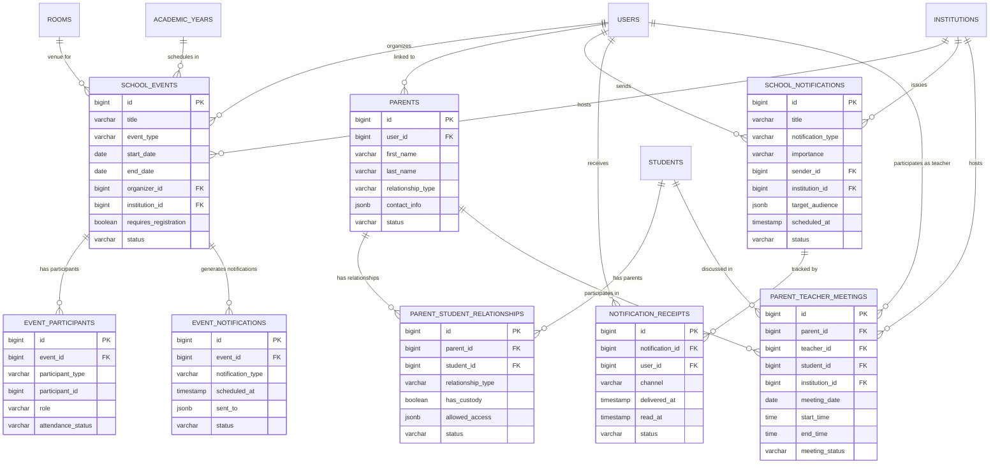

# DB-5E: Məktəb Tədbirlər və Əlaqələr
## Azərbaycan Təhsil İdarəetmə Sistemi (ATİS)

### DOCUMENT INFO
**Version**: 2.1
**Created**: İyul 2025
**Category**: Məktəb İdarəetməsi - Tədbirlər və Əlaqələr
**Technology**: PostgreSQL 15+ with Laravel 11 Migrations

---

## 1. TƏDBİRLƏR VƏ FƏALİYYƏTLƏR

### 1.1 Məktəb Tədbirləri (school_events)

```sql
CREATE TABLE school_events (
    id BIGSERIAL PRIMARY KEY,
    title VARCHAR(200) NOT NULL,
    description TEXT,
    event_type VARCHAR(50) NOT NULL, -- 'academic', 'sports', 'cultural', 'conference', 'meeting', 'holiday', etc.
    start_date DATE NOT NULL,
    end_date DATE NOT NULL,
    start_time TIME,
    end_time TIME,
    is_all_day BOOLEAN DEFAULT false,
    is_recurring BOOLEAN DEFAULT false,
    recurrence_pattern JSONB, -- Stores recurrence rules
    location VARCHAR(200),
    room_id BIGINT,
    organizer_id BIGINT NOT NULL,
    institution_id BIGINT NOT NULL,
    academic_year_id BIGINT,
    term_id BIGINT,
    requires_registration BOOLEAN DEFAULT false,
    registration_deadline TIMESTAMP,
    max_participants INTEGER,
    visibility VARCHAR(20) DEFAULT 'public', -- 'public', 'institution', 'private', 'restricted'
    target_audience JSONB DEFAULT '[]'::jsonb, -- ['students', 'teachers', 'parents', 'staff']
    target_grades JSONB DEFAULT '[]'::jsonb, -- [1, 2, 3] for specific grade levels
    status VARCHAR(20) DEFAULT 'scheduled', -- 'draft', 'scheduled', 'cancelled', 'completed'
    color VARCHAR(7), -- Hex color code for UI display
    attachments JSONB DEFAULT '[]'::jsonb,
    created_at TIMESTAMP DEFAULT NOW(),
    updated_at TIMESTAMP DEFAULT NOW(),
    
    -- Constraints
    CONSTRAINT school_events_room_id_fkey FOREIGN KEY (room_id) REFERENCES rooms(id),
    CONSTRAINT school_events_organizer_id_fkey FOREIGN KEY (organizer_id) REFERENCES users(id),
    CONSTRAINT school_events_institution_id_fkey FOREIGN KEY (institution_id) REFERENCES institutions(id),
    CONSTRAINT school_events_academic_year_id_fkey FOREIGN KEY (academic_year_id) REFERENCES academic_years(id),
    CONSTRAINT school_events_term_id_fkey FOREIGN KEY (term_id) REFERENCES terms(id),
    CONSTRAINT school_events_dates_check CHECK (end_date >= start_date),
    CONSTRAINT school_events_time_check CHECK ((start_time IS NULL AND end_time IS NULL) OR (start_time < end_time)),
    CONSTRAINT school_events_visibility_check CHECK (visibility IN ('public', 'institution', 'private', 'restricted')),
    CONSTRAINT school_events_status_check CHECK (status IN ('draft', 'scheduled', 'cancelled', 'completed')),
    CONSTRAINT school_events_registration_check CHECK (NOT requires_registration OR registration_deadline IS NOT NULL)
);

CREATE INDEX idx_school_events_dates ON school_events(start_date, end_date);
CREATE INDEX idx_school_events_institution ON school_events(institution_id);
CREATE INDEX idx_school_events_organizer ON school_events(organizer_id);
CREATE INDEX idx_school_events_academic_year ON school_events(academic_year_id);
CREATE INDEX idx_school_events_type ON school_events(event_type);
CREATE INDEX idx_school_events_status ON school_events(status);
CREATE INDEX idx_school_events_target_audience ON school_events USING GIN(target_audience);
CREATE INDEX idx_school_events_target_grades ON school_events USING GIN(target_grades);
```

### 1.2 Tədbir İştirakçıları (event_participants)

```sql
CREATE TABLE event_participants (
    id BIGSERIAL PRIMARY KEY,
    event_id BIGINT NOT NULL,
    participant_type VARCHAR(20) NOT NULL, -- 'student', 'teacher', 'parent', 'staff', 'guest'
    participant_id BIGINT,
    participant_name VARCHAR(200), -- For external guests
    participant_email VARCHAR(100),
    participant_phone VARCHAR(20),
    role VARCHAR(50), -- 'attendee', 'presenter', 'organizer', 'volunteer', etc.
    registration_date TIMESTAMP,
    attendance_status VARCHAR(20) DEFAULT 'registered', -- 'registered', 'confirmed', 'attended', 'absent', 'cancelled'
    notes TEXT,
    created_at TIMESTAMP DEFAULT NOW(),
    updated_at TIMESTAMP DEFAULT NOW(),
    
    -- Constraints
    CONSTRAINT event_participants_event_id_fkey FOREIGN KEY (event_id) REFERENCES school_events(id) ON DELETE CASCADE,
    CONSTRAINT event_participants_attendance_status_check CHECK (attendance_status IN ('registered', 'confirmed', 'attended', 'absent', 'cancelled')),
    CONSTRAINT event_participants_unique UNIQUE (event_id, participant_type, participant_id)
);

CREATE INDEX idx_event_participants_event ON event_participants(event_id);
CREATE INDEX idx_event_participants_type_id ON event_participants(participant_type, participant_id);
CREATE INDEX idx_event_participants_status ON event_participants(attendance_status);
CREATE INDEX idx_event_participants_role ON event_participants(role);
```

### 1.3 Tədbir Bildirişləri (event_notifications)

```sql
CREATE TABLE event_notifications (
    id BIGSERIAL PRIMARY KEY,
    event_id BIGINT NOT NULL,
    notification_type VARCHAR(50) NOT NULL, -- 'reminder', 'cancellation', 'rescheduled', 'update', etc.
    subject VARCHAR(200) NOT NULL,
    message TEXT,
    sent_to JSONB NOT NULL, -- [{"type": "participant_type", "id": participant_id}, ...]
    scheduled_at TIMESTAMP NOT NULL,
    sent_at TIMESTAMP,
    status VARCHAR(20) DEFAULT 'pending', -- 'pending', 'sent', 'failed', 'cancelled'
    created_by BIGINT NOT NULL,
    created_at TIMESTAMP DEFAULT NOW(),
    updated_at TIMESTAMP DEFAULT NOW(),
    
    -- Constraints
    CONSTRAINT event_notifications_event_id_fkey FOREIGN KEY (event_id) REFERENCES school_events(id) ON DELETE CASCADE,
    CONSTRAINT event_notifications_created_by_fkey FOREIGN KEY (created_by) REFERENCES users(id),
    CONSTRAINT event_notifications_status_check CHECK (status IN ('pending', 'sent', 'failed', 'cancelled'))
);

CREATE INDEX idx_event_notifications_event ON event_notifications(event_id);
CREATE INDEX idx_event_notifications_scheduled ON event_notifications(scheduled_at);
CREATE INDEX idx_event_notifications_status ON event_notifications(status);
CREATE INDEX idx_event_notifications_sent_to ON event_notifications USING GIN(sent_to);
```

---

## 2. VALIDEYN ƏLAQƏLƏRI VƏ KOMMUNİKASİYA

### 2.1 Valideynlər (parents)

```sql
CREATE TABLE parents (
    id BIGSERIAL PRIMARY KEY,
    user_id BIGINT,
    first_name VARCHAR(100) NOT NULL,
    last_name VARCHAR(100) NOT NULL,
    patronymic VARCHAR(100),
    relationship_type VARCHAR(50) NOT NULL, -- 'mother', 'father', 'guardian', etc.
    national_id VARCHAR(20),
    occupation VARCHAR(100),
    education_level VARCHAR(50),
    is_primary_contact BOOLEAN DEFAULT false,
    contact_info JSONB NOT NULL DEFAULT '{}'::jsonb, -- Email, phone, address
    emergency_contact BOOLEAN DEFAULT false,
    preferred_language VARCHAR(50),
    preferred_contact_method VARCHAR(20), -- 'email', 'phone', 'sms', 'app'
    notes TEXT,
    status VARCHAR(20) DEFAULT 'active', -- 'active', 'inactive'
    created_at TIMESTAMP DEFAULT NOW(),
    updated_at TIMESTAMP DEFAULT NOW(),
    
    -- Constraints
    CONSTRAINT parents_user_id_fkey FOREIGN KEY (user_id) REFERENCES users(id),
    CONSTRAINT parents_status_check CHECK (status IN ('active', 'inactive'))
);

CREATE INDEX idx_parents_user ON parents(user_id);
CREATE INDEX idx_parents_status ON parents(status);
CREATE INDEX idx_parents_contact_info ON parents USING GIN(contact_info);
CREATE INDEX idx_parents_name ON parents(last_name, first_name);
```

### 2.2 Valideyn-Şagird Əlaqələri (parent_student_relationships)

```sql
CREATE TABLE parent_student_relationships (
    id BIGSERIAL PRIMARY KEY,
    parent_id BIGINT NOT NULL,
    student_id BIGINT NOT NULL,
    relationship_type VARCHAR(50) NOT NULL, -- 'mother', 'father', 'guardian', etc.
    is_emergency_contact BOOLEAN DEFAULT false,
    has_custody BOOLEAN DEFAULT true,
    lives_with_student BOOLEAN DEFAULT false,
    has_financial_responsibility BOOLEAN DEFAULT false,
    can_pickup BOOLEAN DEFAULT false,
    allowed_access JSONB DEFAULT '["grades", "attendance", "behavior", "health"]'::jsonb,
    status VARCHAR(20) DEFAULT 'active', -- 'active', 'inactive'
    verified_at TIMESTAMP,
    verified_by BIGINT,
    created_at TIMESTAMP DEFAULT NOW(),
    updated_at TIMESTAMP DEFAULT NOW(),
    
    -- Constraints
    CONSTRAINT parent_student_relationships_parent_id_fkey FOREIGN KEY (parent_id) REFERENCES parents(id),
    CONSTRAINT parent_student_relationships_student_id_fkey FOREIGN KEY (student_id) REFERENCES students(id),
    CONSTRAINT parent_student_relationships_verified_by_fkey FOREIGN KEY (verified_by) REFERENCES users(id),
    CONSTRAINT parent_student_relationships_unique UNIQUE (parent_id, student_id),
    CONSTRAINT parent_student_relationships_status_check CHECK (status IN ('active', 'inactive'))
);

CREATE INDEX idx_parent_student_relationships_parent ON parent_student_relationships(parent_id);
CREATE INDEX idx_parent_student_relationships_student ON parent_student_relationships(student_id);
CREATE INDEX idx_parent_student_relationships_status ON parent_student_relationships(status);
CREATE INDEX idx_parent_student_relationships_access ON parent_student_relationships USING GIN(allowed_access);
```

### 2.3 Məktəb Bildirişləri (school_notifications)

```sql
CREATE TABLE school_notifications (
    id BIGSERIAL PRIMARY KEY,
    title VARCHAR(200) NOT NULL,
    message TEXT NOT NULL,
    notification_type VARCHAR(50) NOT NULL, -- 'announcement', 'alert', 'reminder', 'news', etc.
    importance VARCHAR(20) DEFAULT 'normal', -- 'low', 'normal', 'high', 'critical'
    sender_id BIGINT NOT NULL,
    institution_id BIGINT NOT NULL,
    target_audience JSONB NOT NULL, -- ['students', 'teachers', 'parents', 'staff']
    target_grades JSONB DEFAULT '[]'::jsonb, -- [1, 2, 3] for specific grade levels
    target_users JSONB DEFAULT '[]'::jsonb, -- Specific user IDs if targeted
    scheduled_at TIMESTAMP NOT NULL,
    expires_at TIMESTAMP,
    sent_at TIMESTAMP,
    channels JSONB NOT NULL DEFAULT '["app"]'::jsonb, -- ['app', 'email', 'sms']
    delivery_status JSONB DEFAULT '{}'::jsonb, -- {"app": "sent", "email": "pending"}
    read_count INTEGER DEFAULT 0,
    attachments JSONB DEFAULT '[]'::jsonb,
    requires_acknowledgment BOOLEAN DEFAULT false,
    acknowledgment_count INTEGER DEFAULT 0,
    status VARCHAR(20) DEFAULT 'draft', -- 'draft', 'scheduled', 'sending', 'sent', 'cancelled'
    created_at TIMESTAMP DEFAULT NOW(),
    updated_at TIMESTAMP DEFAULT NOW(),
    
    -- Constraints
    CONSTRAINT school_notifications_sender_id_fkey FOREIGN KEY (sender_id) REFERENCES users(id),
    CONSTRAINT school_notifications_institution_id_fkey FOREIGN KEY (institution_id) REFERENCES institutions(id),
    CONSTRAINT school_notifications_importance_check CHECK (importance IN ('low', 'normal', 'high', 'critical')),
    CONSTRAINT school_notifications_status_check CHECK (status IN ('draft', 'scheduled', 'sending', 'sent', 'cancelled')),
    CONSTRAINT school_notifications_expires_check CHECK (expires_at IS NULL OR expires_at > scheduled_at)
);

CREATE INDEX idx_school_notifications_institution ON school_notifications(institution_id);
CREATE INDEX idx_school_notifications_sender ON school_notifications(sender_id);
CREATE INDEX idx_school_notifications_scheduled ON school_notifications(scheduled_at);
CREATE INDEX idx_school_notifications_type ON school_notifications(notification_type);
CREATE INDEX idx_school_notifications_status ON school_notifications(status);
CREATE INDEX idx_school_notifications_target_audience ON school_notifications USING GIN(target_audience);
CREATE INDEX idx_school_notifications_target_grades ON school_notifications USING GIN(target_grades);
CREATE INDEX idx_school_notifications_target_users ON school_notifications USING GIN(target_users);
```

### 2.4 Bildiriş Oxunma Qeydləri (notification_receipts)

```sql
CREATE TABLE notification_receipts (
    id BIGSERIAL PRIMARY KEY,
    notification_id BIGINT NOT NULL,
    user_id BIGINT NOT NULL,
    channel VARCHAR(20) NOT NULL, -- 'app', 'email', 'sms'
    delivered_at TIMESTAMP,
    read_at TIMESTAMP,
    acknowledged_at TIMESTAMP,
    status VARCHAR(20) DEFAULT 'pending', -- 'pending', 'delivered', 'failed', 'read', 'acknowledged'
    created_at TIMESTAMP DEFAULT NOW(),
    updated_at TIMESTAMP DEFAULT NOW(),
    
    -- Constraints
    CONSTRAINT notification_receipts_notification_id_fkey FOREIGN KEY (notification_id) REFERENCES school_notifications(id),
    CONSTRAINT notification_receipts_user_id_fkey FOREIGN KEY (user_id) REFERENCES users(id),
    CONSTRAINT notification_receipts_channel_check CHECK (channel IN ('app', 'email', 'sms')),
    CONSTRAINT notification_receipts_status_check CHECK (status IN ('pending', 'delivered', 'failed', 'read', 'acknowledged')),
    CONSTRAINT notification_receipts_unique UNIQUE (notification_id, user_id, channel)
);

CREATE INDEX idx_notification_receipts_notification ON notification_receipts(notification_id);
CREATE INDEX idx_notification_receipts_user ON notification_receipts(user_id);
CREATE INDEX idx_notification_receipts_status ON notification_receipts(status);
CREATE INDEX idx_notification_receipts_read ON notification_receipts(read_at);
```

### 2.5 Valideyn-Müəllim Görüşləri (parent_teacher_meetings)

```sql
CREATE TABLE parent_teacher_meetings (
    id BIGSERIAL PRIMARY KEY,
    title VARCHAR(200) NOT NULL,
    description TEXT,
    parent_id BIGINT NOT NULL,
    teacher_id BIGINT NOT NULL,
    student_id BIGINT NOT NULL,
    subject_id BIGINT,
    institution_id BIGINT NOT NULL,
    meeting_date DATE NOT NULL,
    start_time TIME NOT NULL,
    end_time TIME NOT NULL,
    location VARCHAR(100),
    room_id BIGINT,
    meeting_type VARCHAR(50) DEFAULT 'in_person', -- 'in_person', 'phone', 'video'
    meeting_url VARCHAR(255),
    meeting_status VARCHAR(20) DEFAULT 'scheduled', -- 'requested', 'scheduled', 'completed', 'cancelled', 'no_show'
    notes_before TEXT,
    notes_after TEXT,
    follow_up_actions TEXT,
    follow_up_date DATE,
    created_by BIGINT NOT NULL,
    created_at TIMESTAMP DEFAULT NOW(),
    updated_at TIMESTAMP DEFAULT NOW(),
    
    -- Constraints
    CONSTRAINT parent_teacher_meetings_parent_id_fkey FOREIGN KEY (parent_id) REFERENCES parents(id),
    CONSTRAINT parent_teacher_meetings_teacher_id_fkey FOREIGN KEY (teacher_id) REFERENCES users(id),
    CONSTRAINT parent_teacher_meetings_student_id_fkey FOREIGN KEY (student_id) REFERENCES students(id),
    CONSTRAINT parent_teacher_meetings_subject_id_fkey FOREIGN KEY (subject_id) REFERENCES subjects(id),
    CONSTRAINT parent_teacher_meetings_institution_id_fkey FOREIGN KEY (institution_id) REFERENCES institutions(id),
    CONSTRAINT parent_teacher_meetings_room_id_fkey FOREIGN KEY (room_id) REFERENCES rooms(id),
    CONSTRAINT parent_teacher_meetings_created_by_fkey FOREIGN KEY (created_by) REFERENCES users(id),
    CONSTRAINT parent_teacher_meetings_time_check CHECK (end_time > start_time),
    CONSTRAINT parent_teacher_meetings_meeting_type_check CHECK (meeting_type IN ('in_person', 'phone', 'video')),
    CONSTRAINT parent_teacher_meetings_status_check CHECK (meeting_status IN ('requested', 'scheduled', 'completed', 'cancelled', 'no_show'))
);

CREATE INDEX idx_parent_teacher_meetings_parent ON parent_teacher_meetings(parent_id);
CREATE INDEX idx_parent_teacher_meetings_teacher ON parent_teacher_meetings(teacher_id);
CREATE INDEX idx_parent_teacher_meetings_student ON parent_teacher_meetings(student_id);
CREATE INDEX idx_parent_teacher_meetings_date ON parent_teacher_meetings(meeting_date);
CREATE INDEX idx_parent_teacher_meetings_institution ON parent_teacher_meetings(institution_id);
CREATE INDEX idx_parent_teacher_meetings_status ON parent_teacher_meetings(meeting_status);
```

---

## 3. ƏLAQƏLƏNDİRMƏ DİAQRAMI (TƏDBİRLƏR VƏ ƏLAQƏLƏR)


