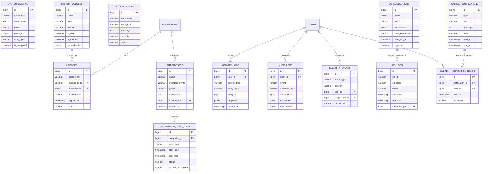

# DB-6: Sistem İnfrastrukturu və Texniki Cədvəllər
## Azərbaycan Təhsil İdarəetmə Sistemi (ATİS)

### DOCUMENT INFO
**Version**: 2.1
**Created**: İyul 2025
**Category**: Sistem İnfrastrukturu və Texniki Cədvəllər
**Technology**: PostgreSQL 15+ with Laravel 11 Migrations

---

## 1. SISTEM MƏLUMAT CƏDVƏLLƏRI

### 1.1 Sistem Konfiqurasyası (system_configs)

```sql
CREATE TABLE system_configs (
    id BIGSERIAL PRIMARY KEY,
    config_key VARCHAR(100) NOT NULL,
    config_value JSONB NOT NULL DEFAULT '{}'::jsonb,
    scope VARCHAR(50) DEFAULT 'global', -- 'global', 'institution', 'module', etc.
    scope_id BIGINT, -- For institution-specific or module-specific settings
    description TEXT,
    data_type VARCHAR(20) NOT NULL, -- 'string', 'integer', 'boolean', 'json', 'array'
    is_encrypted BOOLEAN DEFAULT false,
    is_hidden BOOLEAN DEFAULT false,
    is_readonly BOOLEAN DEFAULT false,
    created_by BIGINT,
    updated_by BIGINT,
    created_at TIMESTAMP DEFAULT NOW(),
    updated_at TIMESTAMP DEFAULT NOW(),
    
    -- Constraints
    CONSTRAINT system_configs_key_scope_unique UNIQUE (config_key, scope, scope_id),
    CONSTRAINT system_configs_created_by_fkey FOREIGN KEY (created_by) REFERENCES users(id),
    CONSTRAINT system_configs_updated_by_fkey FOREIGN KEY (updated_by) REFERENCES users(id),
    CONSTRAINT system_configs_data_type_check CHECK (data_type IN ('string', 'integer', 'boolean', 'json', 'array')),
    CONSTRAINT system_configs_scope_check CHECK (scope IN ('global', 'institution', 'module', 'user'))
);

CREATE INDEX idx_system_configs_key ON system_configs(config_key);
CREATE INDEX idx_system_configs_scope ON system_configs(scope, scope_id);
```

### 1.2 Sistem Modullları (system_modules)

```sql
CREATE TABLE system_modules (
    id BIGSERIAL PRIMARY KEY,
    name VARCHAR(100) NOT NULL,
    code VARCHAR(50) NOT NULL UNIQUE,
    description TEXT,
    version VARCHAR(20),
    is_core BOOLEAN DEFAULT false,
    is_enabled BOOLEAN DEFAULT true,
    requires_license BOOLEAN DEFAULT false,
    dependencies JSONB DEFAULT '[]'::jsonb,
    settings JSONB DEFAULT '{}'::jsonb,
    created_at TIMESTAMP DEFAULT NOW(),
    updated_at TIMESTAMP DEFAULT NOW()
);

CREATE INDEX idx_system_modules_code ON system_modules(code);
CREATE INDEX idx_system_modules_enabled ON system_modules(is_enabled);
CREATE INDEX idx_system_modules_dependencies ON system_modules USING GIN(dependencies);
```

### 1.3 Sistem Lisenziyaları (licenses)

```sql
CREATE TABLE licenses (
    id BIGSERIAL PRIMARY KEY,
    license_key VARCHAR(100) UNIQUE NOT NULL,
    module_code VARCHAR(50) NOT NULL,
    institution_id BIGINT,
    license_type VARCHAR(50) NOT NULL, -- 'trial', 'standard', 'premium', 'enterprise'
    user_limit INTEGER,
    features JSONB DEFAULT '{}'::jsonb,
    issued_at TIMESTAMP NOT NULL,
    expires_at TIMESTAMP,
    activation_date TIMESTAMP,
    last_validation_date TIMESTAMP,
    status VARCHAR(20) DEFAULT 'inactive', -- 'inactive', 'active', 'expired', 'revoked'
    issued_to VARCHAR(200),
    issued_by VARCHAR(200),
    notes TEXT,
    created_at TIMESTAMP DEFAULT NOW(),
    updated_at TIMESTAMP DEFAULT NOW(),
    
    -- Constraints
    CONSTRAINT licenses_module_code_fkey FOREIGN KEY (module_code) REFERENCES system_modules(code),
    CONSTRAINT licenses_institution_id_fkey FOREIGN KEY (institution_id) REFERENCES institutions(id),
    CONSTRAINT licenses_license_type_check CHECK (license_type IN ('trial', 'standard', 'premium', 'enterprise')),
    CONSTRAINT licenses_status_check CHECK (status IN ('inactive', 'active', 'expired', 'revoked')),
    CONSTRAINT licenses_user_limit_check CHECK (user_limit IS NULL OR user_limit > 0)
);

CREATE INDEX idx_licenses_key ON licenses(license_key);
CREATE INDEX idx_licenses_module_code ON licenses(module_code);
CREATE INDEX idx_licenses_institution ON licenses(institution_id);
CREATE INDEX idx_licenses_status ON licenses(status);
CREATE INDEX idx_licenses_expiration ON licenses(expires_at);
```

### 1.4 İnteqrasiyalar (integrations)

```sql
CREATE TABLE integrations (
    id BIGSERIAL PRIMARY KEY,
    name VARCHAR(100) NOT NULL,
    integration_type VARCHAR(50) NOT NULL, -- 'api', 'sso', 'payment', 'lms', 'data_import', etc.
    provider VARCHAR(100) NOT NULL,
    credentials JSONB DEFAULT '{}'::jsonb,
    config JSONB DEFAULT '{}'::jsonb,
    institution_id BIGINT,
    is_system_wide BOOLEAN DEFAULT false,
    is_enabled BOOLEAN DEFAULT true,
    last_sync_at TIMESTAMP,
    sync_frequency VARCHAR(50), -- 'hourly', 'daily', 'weekly', etc.
    api_rate_limit INTEGER,
    created_by BIGINT,
    notes TEXT,
    created_at TIMESTAMP DEFAULT NOW(),
    updated_at TIMESTAMP DEFAULT NOW(),
    
    -- Constraints
    CONSTRAINT integrations_institution_id_fkey FOREIGN KEY (institution_id) REFERENCES institutions(id),
    CONSTRAINT integrations_created_by_fkey FOREIGN KEY (created_by) REFERENCES users(id),
    CONSTRAINT integrations_name_institution_unique UNIQUE (name, institution_id),
    CONSTRAINT integrations_integration_type_check CHECK (integration_type IN ('api', 'sso', 'payment', 'lms', 'data_import', 'notification', 'calendar', 'email', 'storage'))
);

CREATE INDEX idx_integrations_type ON integrations(integration_type);
CREATE INDEX idx_integrations_provider ON integrations(provider);
CREATE INDEX idx_integrations_institution ON integrations(institution_id);
CREATE INDEX idx_integrations_enabled ON integrations(is_enabled);
```

### 1.5 İnteqrasiya Sinxronizasiya Qeydləri (integration_sync_logs)

```sql
CREATE TABLE integration_sync_logs (
    id BIGSERIAL PRIMARY KEY,
    integration_id BIGINT NOT NULL,
    sync_type VARCHAR(50) NOT NULL, -- 'full', 'incremental', 'export', 'import', etc.
    start_time TIMESTAMP NOT NULL,
    end_time TIMESTAMP,
    status VARCHAR(20) DEFAULT 'running', -- 'running', 'completed', 'failed', 'cancelled'
    records_processed INTEGER DEFAULT 0,
    records_created INTEGER DEFAULT 0,
    records_updated INTEGER DEFAULT 0,
    records_failed INTEGER DEFAULT 0,
    error_message TEXT,
    error_details JSONB DEFAULT '{}'::jsonb,
    sync_summary JSONB DEFAULT '{}'::jsonb,
    initiated_by BIGINT,
    created_at TIMESTAMP DEFAULT NOW(),
    updated_at TIMESTAMP DEFAULT NOW(),
    
    -- Constraints
    CONSTRAINT integration_sync_logs_integration_id_fkey FOREIGN KEY (integration_id) REFERENCES integrations(id),
    CONSTRAINT integration_sync_logs_initiated_by_fkey FOREIGN KEY (initiated_by) REFERENCES users(id),
    CONSTRAINT integration_sync_logs_status_check CHECK (status IN ('running', 'completed', 'failed', 'cancelled')),
    CONSTRAINT integration_sync_logs_sync_type_check CHECK (sync_type IN ('full', 'incremental', 'export', 'import'))
);

CREATE INDEX idx_integration_sync_logs_integration ON integration_sync_logs(integration_id);
CREATE INDEX idx_integration_sync_logs_status ON integration_sync_logs(status);
CREATE INDEX idx_integration_sync_logs_start_time ON integration_sync_logs(start_time);
```

---

## 2. SİSTEM AUDIT VƏ MONİTORİNQ CƏDVƏLLƏRI

### 2.1 Sistem İstifadəçi Fəaliyyəti Qeydləri (activity_logs)

```sql
CREATE TABLE activity_logs (
    id BIGSERIAL PRIMARY KEY,
    user_id BIGINT,
    ip_address VARCHAR(45),
    user_agent TEXT,
    activity_type VARCHAR(100) NOT NULL, -- 'login', 'logout', 'create', 'update', 'delete', 'export', etc.
    entity_type VARCHAR(100), -- Model/table name
    entity_id BIGINT,
    description TEXT,
    properties JSONB DEFAULT '{}'::jsonb,
    before_state JSONB DEFAULT '{}'::jsonb,
    after_state JSONB DEFAULT '{}'::jsonb,
    institution_id BIGINT,
    created_at TIMESTAMP DEFAULT NOW()
);

CREATE INDEX idx_activity_logs_user ON activity_logs(user_id);
CREATE INDEX idx_activity_logs_activity_type ON activity_logs(activity_type);
CREATE INDEX idx_activity_logs_entity ON activity_logs(entity_type, entity_id);
CREATE INDEX idx_activity_logs_institution ON activity_logs(institution_id);
CREATE INDEX idx_activity_logs_created_at ON activity_logs(created_at);
CREATE INDEX idx_activity_logs_properties ON activity_logs USING GIN(properties);
```

### 2.2 Sistem Audit Qeydləri (audit_logs)

```sql
CREATE TABLE audit_logs (
    id BIGSERIAL PRIMARY KEY,
    user_id BIGINT,
    event VARCHAR(100) NOT NULL, -- 'authentication', 'authorization', 'data_access', 'configuration_change', 'admin_action', etc.
    auditable_type VARCHAR(100), -- Model/table name
    auditable_id BIGINT,
    old_values JSONB DEFAULT '{}'::jsonb,
    new_values JSONB DEFAULT '{}'::jsonb,
    url TEXT,
    ip_address VARCHAR(45),
    user_agent TEXT,
    tags JSONB DEFAULT '[]'::jsonb,
    institution_id BIGINT,
    created_at TIMESTAMP DEFAULT NOW()
);

CREATE INDEX idx_audit_logs_user ON audit_logs(user_id);
CREATE INDEX idx_audit_logs_event ON audit_logs(event);
CREATE INDEX idx_audit_logs_auditable ON audit_logs(auditable_type, auditable_id);
CREATE INDEX idx_audit_logs_institution ON audit_logs(institution_id);
CREATE INDEX idx_audit_logs_created_at ON audit_logs(created_at);
CREATE INDEX idx_audit_logs_tags ON audit_logs USING GIN(tags);
```

### 2.3 Təhlükəsizlik Hadisələri (security_events)

```sql
CREATE TABLE security_events (
    id BIGSERIAL PRIMARY KEY,
    event_type VARCHAR(100) NOT NULL, -- 'failed_login', 'password_reset', 'permission_change', 'suspicious_activity', etc.
    severity VARCHAR(20) NOT NULL, -- 'info', 'warning', 'critical'
    user_id BIGINT,
    target_user_id BIGINT,
    ip_address VARCHAR(45),
    location_data JSONB DEFAULT '{}'::jsonb,
    user_agent TEXT,
    description TEXT,
    event_data JSONB DEFAULT '{}'::jsonb,
    resolution VARCHAR(50), -- 'resolved', 'false_positive', 'action_taken', 'escalated', 'ignored'
    resolution_notes TEXT,
    resolved_by BIGINT,
    resolved_at TIMESTAMP,
    institution_id BIGINT,
    created_at TIMESTAMP DEFAULT NOW(),
    
    -- Constraints
    CONSTRAINT security_events_user_id_fkey FOREIGN KEY (user_id) REFERENCES users(id),
    CONSTRAINT security_events_target_user_id_fkey FOREIGN KEY (target_user_id) REFERENCES users(id),
    CONSTRAINT security_events_resolved_by_fkey FOREIGN KEY (resolved_by) REFERENCES users(id),
    CONSTRAINT security_events_institution_id_fkey FOREIGN KEY (institution_id) REFERENCES institutions(id),
    CONSTRAINT security_events_severity_check CHECK (severity IN ('info', 'warning', 'critical'))
);

CREATE INDEX idx_security_events_type ON security_events(event_type);
CREATE INDEX idx_security_events_user ON security_events(user_id);
CREATE INDEX idx_security_events_target_user ON security_events(target_user_id);
CREATE INDEX idx_security_events_severity ON security_events(severity);
CREATE INDEX idx_security_events_created_at ON security_events(created_at);
CREATE INDEX idx_security_events_resolution ON security_events(resolution);
CREATE INDEX idx_security_events_institution ON security_events(institution_id);
```

### 2.4 Sistem Xətaları (system_errors)

```sql
CREATE TABLE system_errors (
    id BIGSERIAL PRIMARY KEY,
    error_code VARCHAR(50),
    error_type VARCHAR(100) NOT NULL,
    message TEXT NOT NULL,
    file_path TEXT,
    line_number INTEGER,
    stack_trace TEXT,
    context JSONB DEFAULT '{}'::jsonb,
    request_data JSONB DEFAULT '{}'::jsonb,
    user_id BIGINT,
    ip_address VARCHAR(45),
    user_agent TEXT,
    severity VARCHAR(20) NOT NULL DEFAULT 'error', -- 'debug', 'info', 'warning', 'error', 'critical'
    status VARCHAR(20) DEFAULT 'open', -- 'open', 'investigating', 'resolved', 'ignored'
    resolved_at TIMESTAMP,
    resolved_by BIGINT,
    resolution_notes TEXT,
    created_at TIMESTAMP DEFAULT NOW(),
    
    -- Constraints
    CONSTRAINT system_errors_user_id_fkey FOREIGN KEY (user_id) REFERENCES users(id),
    CONSTRAINT system_errors_resolved_by_fkey FOREIGN KEY (resolved_by) REFERENCES users(id),
    CONSTRAINT system_errors_severity_check CHECK (severity IN ('debug', 'info', 'warning', 'error', 'critical')),
    CONSTRAINT system_errors_status_check CHECK (status IN ('open', 'investigating', 'resolved', 'ignored'))
);

CREATE INDEX idx_system_errors_error_code ON system_errors(error_code);
CREATE INDEX idx_system_errors_error_type ON system_errors(error_type);
CREATE INDEX idx_system_errors_user ON system_errors(user_id);
CREATE INDEX idx_system_errors_severity ON system_errors(severity);
CREATE INDEX idx_system_errors_status ON system_errors(status);
CREATE INDEX idx_system_errors_created_at ON system_errors(created_at);
```

### 2.5 Performans Göstəriciləri (performance_metrics)

```sql
CREATE TABLE performance_metrics (
    id BIGSERIAL PRIMARY KEY,
    metric_type VARCHAR(100) NOT NULL, -- 'request', 'query', 'job', 'api_call', etc.
    name VARCHAR(100) NOT NULL,
    value DECIMAL(12,4) NOT NULL,
    unit VARCHAR(20) NOT NULL, -- 'ms', 'seconds', 'bytes', 'count', etc.
    context JSONB DEFAULT '{}'::jsonb,
    timestamp TIMESTAMP DEFAULT NOW(),
    request_id VARCHAR(100),
    user_id BIGINT,
    instance_id VARCHAR(100),
    endpoint VARCHAR(200),
    module_code VARCHAR(50),
    institution_id BIGINT,
    
    -- Constraints
    CONSTRAINT performance_metrics_user_id_fkey FOREIGN KEY (user_id) REFERENCES users(id),
    CONSTRAINT performance_metrics_module_code_fkey FOREIGN KEY (module_code) REFERENCES system_modules(code),
    CONSTRAINT performance_metrics_institution_id_fkey FOREIGN KEY (institution_id) REFERENCES institutions(id)
);

CREATE INDEX idx_performance_metrics_type ON performance_metrics(metric_type);
CREATE INDEX idx_performance_metrics_name ON performance_metrics(name);
CREATE INDEX idx_performance_metrics_timestamp ON performance_metrics(timestamp);
CREATE INDEX idx_performance_metrics_request_id ON performance_metrics(request_id);
CREATE INDEX idx_performance_metrics_user ON performance_metrics(user_id);
CREATE INDEX idx_performance_metrics_endpoint ON performance_metrics(endpoint);
CREATE INDEX idx_performance_metrics_module ON performance_metrics(module_code);
CREATE INDEX idx_performance_metrics_institution ON performance_metrics(institution_id);
```

---

## 3. SİSTEM İŞ CƏDVƏLİ VƏ BİLDİRİŞLƏR

### 3.1 Planlaşdırılmış İşlər (scheduled_jobs)

```sql
CREATE TABLE scheduled_jobs (
    id BIGSERIAL PRIMARY KEY,
    name VARCHAR(100) NOT NULL,
    job_class VARCHAR(200) NOT NULL,
    parameters JSONB DEFAULT '{}'::jsonb,
    cron_expression VARCHAR(100),
    interval_minutes INTEGER,
    next_run_at TIMESTAMP,
    timezone VARCHAR(50) DEFAULT 'UTC',
    is_active BOOLEAN DEFAULT true,
    is_running BOOLEAN DEFAULT false,
    last_run_at TIMESTAMP,
    last_run_status VARCHAR(20), -- 'success', 'failed', 'cancelled'
    last_run_message TEXT,
    last_run_duration INTEGER, -- in seconds
    run_count INTEGER DEFAULT 0,
    failure_count INTEGER DEFAULT 0,
    max_attempts INTEGER DEFAULT 1,
    retry_delay_minutes INTEGER DEFAULT 5,
    created_by BIGINT,
    created_at TIMESTAMP DEFAULT NOW(),
    updated_at TIMESTAMP DEFAULT NOW(),
    
    -- Constraints
    CONSTRAINT scheduled_jobs_created_by_fkey FOREIGN KEY (created_by) REFERENCES users(id),
    CONSTRAINT scheduled_jobs_last_run_status_check CHECK (last_run_status IS NULL OR last_run_status IN ('success', 'failed', 'cancelled')),
    CONSTRAINT scheduled_jobs_schedule_check CHECK ((cron_expression IS NOT NULL) OR (interval_minutes IS NOT NULL))
);

CREATE INDEX idx_scheduled_jobs_next_run ON scheduled_jobs(next_run_at);
CREATE INDEX idx_scheduled_jobs_active ON scheduled_jobs(is_active);
CREATE INDEX idx_scheduled_jobs_running ON scheduled_jobs(is_running);
CREATE INDEX idx_scheduled_jobs_name ON scheduled_jobs(name);
```

### 3.2 İş Qeydləri (job_logs)

```sql
CREATE TABLE job_logs (
    id BIGSERIAL PRIMARY KEY,
    job_id VARCHAR(100),
    job_class VARCHAR(200) NOT NULL,
    queue VARCHAR(100),
    attempt INTEGER NOT NULL DEFAULT 1,
    status VARCHAR(20) NOT NULL, -- 'queued', 'processing', 'completed', 'failed', 'cancelled'
    payload JSONB DEFAULT '{}'::jsonb,
    result JSONB DEFAULT '{}'::jsonb,
    error_message TEXT,
    error_trace TEXT,
    start_time TIMESTAMP,
    end_time TIMESTAMP,
    duration INTEGER, -- in seconds
    scheduled_job_id BIGINT,
    executed_by BIGINT,
    created_at TIMESTAMP DEFAULT NOW(),
    
    -- Constraints
    CONSTRAINT job_logs_scheduled_job_id_fkey FOREIGN KEY (scheduled_job_id) REFERENCES scheduled_jobs(id),
    CONSTRAINT job_logs_executed_by_fkey FOREIGN KEY (executed_by) REFERENCES users(id),
    CONSTRAINT job_logs_status_check CHECK (status IN ('queued', 'processing', 'completed', 'failed', 'cancelled'))
);

CREATE INDEX idx_job_logs_job_id ON job_logs(job_id);
CREATE INDEX idx_job_logs_job_class ON job_logs(job_class);
CREATE INDEX idx_job_logs_status ON job_logs(status);
CREATE INDEX idx_job_logs_queue ON job_logs(queue);
CREATE INDEX idx_job_logs_start_time ON job_logs(start_time);
CREATE INDEX idx_job_logs_scheduled_job ON job_logs(scheduled_job_id);
```

### 3.3 Sistem Bildirişləri (system_notifications)

```sql
CREATE TABLE system_notifications (
    id BIGSERIAL PRIMARY KEY,
    type VARCHAR(100) NOT NULL, -- 'maintenance', 'update', 'alert', 'announcement', etc.
    title VARCHAR(200) NOT NULL,
    message TEXT NOT NULL,
    level VARCHAR(20) DEFAULT 'info', -- 'info', 'warning', 'danger', 'success'
    icon VARCHAR(50),
    action_text VARCHAR(100),
    action_url VARCHAR(255),
    start_at TIMESTAMP,
    end_at TIMESTAMP,
    is_dismissible BOOLEAN DEFAULT true,
    target_roles JSONB DEFAULT '[]'::jsonb, -- Role IDs
    target_institutions JSONB DEFAULT '[]'::jsonb, -- Institution IDs
    created_by BIGINT,
    created_at TIMESTAMP DEFAULT NOW(),
    updated_at TIMESTAMP DEFAULT NOW(),
    
    -- Constraints
    CONSTRAINT system_notifications_created_by_fkey FOREIGN KEY (created_by) REFERENCES users(id),
    CONSTRAINT system_notifications_level_check CHECK (level IN ('info', 'warning', 'danger', 'success')),
    CONSTRAINT system_notifications_date_check CHECK (end_at IS NULL OR end_at > start_at)
);

CREATE INDEX idx_system_notifications_type ON system_notifications(type);
CREATE INDEX idx_system_notifications_level ON system_notifications(level);
CREATE INDEX idx_system_notifications_dates ON system_notifications(start_at, end_at);
CREATE INDEX idx_system_notifications_target_roles ON system_notifications USING GIN(target_roles);
CREATE INDEX idx_system_notifications_target_institutions ON system_notifications USING GIN(target_institutions);
```

### 3.4 Sistem Bildiriş Oxunma Qeydləri (system_notification_reads)

```sql
CREATE TABLE system_notification_reads (
    id BIGSERIAL PRIMARY KEY,
    notification_id BIGINT NOT NULL,
    user_id BIGINT NOT NULL,
    read_at TIMESTAMP NOT NULL DEFAULT NOW(),
    dismissed BOOLEAN DEFAULT false,
    dismissed_at TIMESTAMP,
    device_info JSONB DEFAULT '{}'::jsonb,
    
    -- Constraints
    CONSTRAINT system_notification_reads_notification_id_fkey FOREIGN KEY (notification_id) REFERENCES system_notifications(id) ON DELETE CASCADE,
    CONSTRAINT system_notification_reads_user_id_fkey FOREIGN KEY (user_id) REFERENCES users(id),
    CONSTRAINT system_notification_reads_unique UNIQUE (notification_id, user_id)
);

CREATE INDEX idx_system_notification_reads_notification ON system_notification_reads(notification_id);
CREATE INDEX idx_system_notification_reads_user ON system_notification_reads(user_id);
CREATE INDEX idx_system_notification_reads_read_at ON system_notification_reads(read_at);
CREATE INDEX idx_system_notification_reads_dismissed ON system_notification_reads(dismissed);
```

---

## 4. ƏLAQƏLƏNDİRMƏ DİAQRAMI (SİSTEM İNFRASTRUKTURU)


