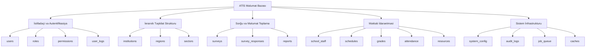

# DB-1: Məlumat Bazası Arxitekturası və Ümumi Prinsiplər
## Azərbaycan Təhsil İdarəetmə Sistemi (ATİS)

### DOCUMENT INFO
**Version**: 2.1
**Created**: İyul 2025
**Category**: Məlumat Bazası Arxitekturası və Layihələndirmə
**Technology**: PostgreSQL 15+ with Laravel 11 Migrations

---

## 1. MƏLUMAT BAZASI ARXİTEKTURA İCMALI

### 1.1 Yüksək Səviyyəli Dizayn

ATİS məlumat bazası arxitekturası aşağıdakı əsas məqsədlərlə layihələndirilmişdir:

- **Skalabillik**: Respublika üzrə 700+ təhsil müəssisəsi və 1,400+ istifadəçini dəstəkləyə bilmək
- **Təhlükəsizlik**: İerarxik rol-əsaslı sətir səviyyəsində təhlükəsizlik
- **Audit**: Bütün əməliyyatların tam izlənməsi və hesabatlılıq
- **Performans**: İndekslər və keş mexanizmləri ilə optimal iş sürəti təmin edilməsi
- **İntensiv Sorğu və Hesabat**: Kompleks sorğuların yüksək sürətlə işlənməsi



### 1.2 Layihələndirmə Prinsipləri

#### 1.2.1 Normallaşdırma və Konvensiyalar

- **Normallaşdırma Səviyyəsi**: 3NF (Third Normal Form) standartına uyğun, bəzi performans-kritik cədvəllər üçün məqsədyönlü denormalizasiya
- **Adlandırma Konvensiyaları**:
  * Cədvəl adları: Çoxluqda, kiçik hərflərlə, alt xətt ilə ayrılmış (_)
  * Sütun adları: Kiçik hərflərlə, alt xətt ilə ayrılmış (_)
  * İndeks adları: `idx_[cədvəl adı]_[sütun adları]` formatında
  * Foreign key-lər: `[cədvəl adı]_[sütun adı]_fkey` formatında
  * Unique məhdudiyyətlər: `[cədvəl adı]_[sütun adı(ları)]_unique` formatında

#### 1.2.2 Məlumatların Tamlığı və Konsisentliyi

- **Foreign Key Məhdudiyyətləri**: Əlaqəli cədvəllər arasında referensial tamlıq üçün CASCADE və RESTRICT istifadə edilir
- **İntrinsik Məhdudiyyətlər**: CHECK məhdudiyyətləri ilə məlumat validasiyası
- **Trigger-lər**: Əhəmiyyətli cədvəllərdə dəyişiklikləri izləmək üçün avtomatik audit sistemləri
- **Transaction İzolasiyası**: REPEATABLE READ səviyyəsində təmin edilmiş izolasiya
- **Optimistic Concurrency Control**: Eyni zamanda dəyişikliklər üçün versiya sütunları

#### 1.2.3 JSONB İntensiv İstifadəsi

PostgreSQL-in JSONB tipi aşağıdakı hallarda istifadə edilir:

- **Sorğu Strukturları**: Dinamik sorğu formalarını saxlamaq üçün
- **İnstitusiya Metadata**: Müxtəlif təşkilat növləri üçün xüsusi məlumatlar
- **İstifadəçi Tərcihlər**: Dinamik tənzimləmələr və tərcihlər
- **Audit Jurnalları**: Dəyişiklik tarixçəsini ən optimal şəkildə saxlamaq üçün

**JSONB İndeksləşdirmə Strategiyaları**:
```sql
-- GIN indeksləri ilə məlumatların sürətli axtarışı
CREATE INDEX idx_institution_metadata ON institutions USING GIN(metadata);
CREATE INDEX idx_survey_responses_data ON survey_responses USING GIN(responses);

-- JSONB-spesifik əməliyyatlar üçün funksional indekslər
CREATE INDEX idx_institution_location_city ON institutions ((location->>'city'));
```

---

## 2. MƏLUMAT BAZASI STATİSTİKASI VƏ PROQNOZLAR

### 2.1 Məlumat Həcmi və Artım Proqnozları

```
-- İlkin İstehsal Məlumat Həcmi Gözləntiləri
Ümumi Cədvəllər: 30+ (əsas və köməkçi cədvəllər)
Ümumi İstifadəçilər: ~1,400 (bütün rollar)
İnstitusiyalar: ~700 (məktəblər, sektorlar, regionlar)
Gündəlik Əməliyyatlar: ~10,000 sorğu və yazma əməliyyatları
Saxlama Proqnozu: 50GB başlanğıc, 3 il sonra 200GB
```

**Artım Proqnozu**:

| İl    | İstifadəçilər | İnstitusiyalar | Sorğu Cavabları | Əsas DB Ölçüsü | Log/Arxiv DB Ölçüsü |
|-------|--------------|----------------|-----------------|---------------|--------------------|
| 2025  | 1,400        | 700            | 10,000          | 50 GB         | 5 GB               |
| 2026  | 1,800        | 850            | 50,000          | 100 GB        | 25 GB              |
| 2027  | 2,500        | 1,000          | 150,000         | 200 GB        | 100 GB             |

### 2.2 Performans Hədəfləri

**Aktiv İstifadəçi Proqnozu**:
- Eyni anda aktiv istifadəçilər: 200+
- Pik vaxtlarda sorğu tezliyi: 50+ sorğu/saniyə
- Gündəlik maksimal yazma əməliyyatları: 100,000+

**Sorğu Performans Hədəfləri**:
- Sadə sorğular (login, əsas məlumatlar): < 100ms
- Orta mürəkkəblikli sorğular (filtrlənmiş hesabatlar): < 500ms
- Mürəkkəb sorğular (analitik hesabatlar): < 2s
- Batch əməliyyatlar: < 10s

**Yüksək Əlçatanlıq Hədəfləri**:
- Sistem əlçatanlığı: 99.95%+
- Planlaşdırılmış texniki xidmət pəncərəsi: Ayda 4 saat
- Məlumat itkisi riski: 0% (tam nüsxələmə və yükləmə strategiyası ilə)

---

## 3. PERFORMANS OPTİMİZASİYA STRATEGİYALARI

### 3.1 İndeksləmə Strategiyaları

**Əsas İndeksləmə Prinsipləri**:
1. Bütün Foreign Key-lərə indekslər
2. Sorğu şərtlərində tez-tez istifadə olunan sütunlara indekslər 
3. Sorğu birləşmələrində istifadə edilən sütunlara indekslər
4. Hesabat sorğuları üçün mürəkkəb indekslər

**İndeks Növləri və İstifadəsi**:
- **B-tree indekslər**: Əksər sütunlar üçün standart indeks
- **GIN indekslər**: JSONB, array və tam mətn axtarışları üçün
- **BRIN indekslər**: Böyük tarix sütunları üçün (logs, audit)
- **Partial indekslər**: Məhdud şərtlərdə istifadə üçün (məs. sadəcə aktiv qeydlər)

**Nümunə İndeksləmə Strategiyaları**:
```sql
-- Çox istifadə edilən filter üçün partial indeks
CREATE INDEX idx_users_active_login ON users(is_active, last_login_at) WHERE is_active = true;

-- İerarxik sorğular üçün kompozit indeks
CREATE INDEX idx_institutions_parent_level ON institutions(parent_id, level);

-- JSONB məlumatları üçün GIN indeksi
CREATE INDEX idx_surveys_target_institutions ON surveys USING GIN(target_institutions);

-- Hesabat tarixləri üçün BRIN indeksi (çox böyük cədvəllər)
CREATE INDEX idx_survey_responses_dates ON survey_responses USING BRIN(created_at, submitted_at);

-- Çox sütunlu sorğu üçün mürəkkəb indeks
CREATE INDEX idx_institution_search ON institutions(name, type, region_code, is_active);
```

### 3.2 Sorğu Optimallaşdırma

**Sorğu Dizaynı Prinsipləri**:
1. N+1 sorğu problemindən qaçınma (eager loading)
2. İndeksləri səmərəli istifadə edən sorğular
3. Mümkün olduğunca az cədvəl birləşməsi

**Common Table Expressions (CTE) və Window funksiyaları**:
```sql
-- İerarxik məlumat üçün recursiv CTE
WITH RECURSIVE institution_hierarchy AS (
    SELECT id, name, parent_id, 0 AS depth
    FROM institutions
    WHERE id = :root_id
    UNION ALL
    SELECT i.id, i.name, i.parent_id, h.depth + 1
    FROM institutions i
    JOIN institution_hierarchy h ON i.parent_id = h.id
)
SELECT * FROM institution_hierarchy;

-- Window funksiyaları ilə hesabatlar
SELECT 
    institution_id, 
    COUNT(*) AS response_count,
    AVG(progress_percentage) AS avg_progress,
    RANK() OVER (ORDER BY COUNT(*) DESC) AS response_rank
FROM survey_responses
WHERE survey_id = :survey_id
GROUP BY institution_id;
```

**Sorğu Planı Analizi və Optimallaşdırma**:
- `EXPLAIN ANALYZE` ilə sorğu planlarının mütəmadi analizi
- Vacib sorğuların mütəmadi monitorinqi
- Problematik sorğuların yenidən yazılması və optimallaşdırılması

### 3.3 Partitioning və Sharding Strategiyaları

**Cədvəl Partisiyalaşdırma**:

Böyük cədvəllər üçün partisiyalaşdırma strategiyaları:

```sql
-- Tarix əsasında partisiyalaşdırma (survey_responses cədvəli üçün)
CREATE TABLE survey_responses (
    id BIGSERIAL,
    survey_id BIGINT NOT NULL,
    -- digər sütunlar
    created_at TIMESTAMP NOT NULL
) PARTITION BY RANGE (created_at);

-- Partisiya cədvəlləri
CREATE TABLE survey_responses_2025 PARTITION OF survey_responses
    FOR VALUES FROM ('2025-01-01') TO ('2026-01-01');
    
CREATE TABLE survey_responses_2026 PARTITION OF survey_responses
    FOR VALUES FROM ('2026-01-01') TO ('2027-01-01');
```

**İnstitusiya əsasında Sharding**:

Gələcək miqyaslaşma üçün institusiya əsasında sharding:

```sql
-- Institusiya əsasında List partisiyalaşdırma
CREATE TABLE institution_data (
    id BIGSERIAL,
    institution_id BIGINT NOT NULL,
    -- digər sütunlar
) PARTITION BY LIST (institution_id);

-- Region partisiyaları
CREATE TABLE institution_data_region_1 PARTITION OF institution_data
    FOR VALUES IN (1, 2, 3, 4, 5); -- Region 1 institutions
    
CREATE TABLE institution_data_region_2 PARTITION OF institution_data
    FOR VALUES IN (6, 7, 8, 9, 10); -- Region 2 institutions
```

---

## 4. TƏHLÜKƏSİZLİK VƏ MƏLUMAT QORUMA

### 4.1 Məlumat Şifrələmə Strategiyaları

**Həssas Məlumatların Şifrələnməsi**:
- Şəxsi məlumatlar üçün sütun səviyyəsində şifrələmə
- Həssas sənədlər üçün ikili şifrələmə sistemi
- Hashed parollar və təhlükəsiz saxlama

**Şifrələmə İmplementasiyası**:
```sql
-- Həssas məlumatlar üçün şifrələnmiş sütunlar
CREATE TABLE personal_data (
    id BIGSERIAL PRIMARY KEY,
    user_id BIGINT NOT NULL,
    data_key VARCHAR(255) NOT NULL, -- şifrələmə açarı identifikatoru
    encrypted_data BYTEA NOT NULL,   -- şifrələnmiş məlumat
    created_at TIMESTAMP DEFAULT NOW(),
    updated_at TIMESTAMP DEFAULT NOW()
);

-- pgcrypto extension istifadəsi
CREATE EXTENSION IF NOT EXISTS pgcrypto;

-- Şifrələmə funksiyaları
CREATE OR REPLACE FUNCTION encrypt_data(data TEXT, key TEXT) 
RETURNS BYTEA AS $$
BEGIN
    RETURN pgp_sym_encrypt(data, key);
END;
$$ LANGUAGE plpgsql SECURITY DEFINER;

CREATE OR REPLACE FUNCTION decrypt_data(encrypted_data BYTEA, key TEXT) 
RETURNS TEXT AS $$
BEGIN
    RETURN pgp_sym_decrypt(encrypted_data, key);
END;
$$ LANGUAGE plpgsql SECURITY DEFINER;
```

### 4.2 Row-Level Security (RLS) və Sətir Səviyyəsində Təhlükəsizlik

**RLS Tətbiqi**:

ATİS sistemində institusiya və ierarxiya əsaslı məlumat əlçatanlığı üçün sətir səviyyəsində təhlükəsizlik:

```sql
-- RLS aktivləşdirilməsi
ALTER TABLE institutions ENABLE ROW LEVEL SECURITY;

-- SuperAdmin üçün tam əlçatanlıq
CREATE POLICY superadmin_all_access ON institutions
    USING (EXISTS (
        SELECT 1 FROM users
        JOIN roles ON users.role_id = roles.id
        WHERE roles.name = 'superadmin' AND users.id = current_user_id()
    ));

-- RegionAdmin üçün regional əlçatanlıq
CREATE POLICY region_admin_access ON institutions
    USING (
        EXISTS (
            SELECT 1 FROM users
            JOIN roles ON users.role_id = roles.id
            WHERE roles.name = 'regionadmin' 
            AND users.institution_id IN (
                SELECT id FROM institutions 
                WHERE id = institutions.id OR id = institutions.parent_id
            )
        )
    );

-- SektorAdmin və SchoolAdmin üçün məhdud əlçatanlıq
CREATE POLICY subordinate_access ON institutions
    USING (
        EXISTS (
            WITH RECURSIVE inst_hierarchy AS (
                SELECT id FROM institutions 
                WHERE id = (SELECT institution_id FROM users WHERE id = current_user_id())
                UNION ALL
                SELECT i.id FROM institutions i
                JOIN inst_hierarchy ih ON i.parent_id = ih.id
            )
            SELECT 1 FROM inst_hierarchy 
            WHERE id = institutions.id
        )
    );
```

### 4.3 Audit və İzləmə

**Audit Logging**:

Bütün əhəmiyyətli dəyişikliklər üçün audit jurnal sistemi:

```sql
-- Audit log cədvəli
CREATE TABLE audit_logs (
    id BIGSERIAL PRIMARY KEY,
    user_id BIGINT,
    entity_type VARCHAR(100) NOT NULL, -- 'user', 'institution', etc.
    entity_id BIGINT NOT NULL,
    action VARCHAR(20) NOT NULL, -- 'create', 'update', 'delete'
    old_values JSONB,
    new_values JSONB,
    ip_address INET,
    user_agent TEXT,
    created_at TIMESTAMP DEFAULT NOW()
);

-- İndekslər
CREATE INDEX idx_audit_logs_entity ON audit_logs(entity_type, entity_id);
CREATE INDEX idx_audit_logs_user_action ON audit_logs(user_id, action);
CREATE INDEX idx_audit_logs_timestamp ON audit_logs(created_at);

-- Audit trigger funksiyası
CREATE OR REPLACE FUNCTION audit_trigger_function()
RETURNS TRIGGER AS $$
BEGIN
    IF TG_OP = 'INSERT' THEN
        INSERT INTO audit_logs (
            user_id, entity_type, entity_id, action, 
            old_values, new_values, ip_address
        ) VALUES (
            current_user_id(), TG_TABLE_NAME, NEW.id, 'create',
            NULL, to_jsonb(NEW), current_client_ip()
        );
    ELSIF TG_OP = 'UPDATE' THEN
        INSERT INTO audit_logs (
            user_id, entity_type, entity_id, action, 
            old_values, new_values, ip_address
        ) VALUES (
            current_user_id(), TG_TABLE_NAME, NEW.id, 'update',
            to_jsonb(OLD), to_jsonb(NEW), current_client_ip()
        );
    ELSIF TG_OP = 'DELETE' THEN
        INSERT INTO audit_logs (
            user_id, entity_type, entity_id, action, 
            old_values, new_values, ip_address
        ) VALUES (
            current_user_id(), TG_TABLE_NAME, OLD.id, 'delete',
            to_jsonb(OLD), NULL, current_client_ip()
        );
    END IF;
    RETURN NULL;
END;
$$ LANGUAGE plpgsql;
```

---

## 5. BACKUP VƏ BƏRPA STRATEGİYALARI

### 5.1 Backup Planı

**Backup Tezliyi və Məzmunu**:
- **Tam Backup**: Həftədə bir dəfə (bazar günləri)
- **İnkremental Backup**: Hər gün (iş günləri)
- **Continuous WAL Arxivləşdirməsi**: Point-in-time recovery üçün

**Backup Saxlama Siyasəti**:
- Gündəlik backuplar: 30 gün
- Həftəlik tam backuplar: 3 ay
- Aylıq backuplar: 1 il
- Rüblük backuplar: 3 il

### 5.2 Fəlakət Bərpası və Yüksək Əlçatanlıq

**Recovery Time Objective (RTO)**: 
- Kritik sistem komponenti: < 1 saat
- Tam sistem: < 4 saat

**Recovery Point Objective (RPO)**:
- Maksimum məlumat itkisi: < 15 dəqiqə

**Replikasiya və Yüksək Əlçatanlıq**:
- **İsti Standby**: Senkron replikasiya ilə
- **Avtomatik Failover**: Avtomatik işə düşmə mexanizmi
- **Coğrafi Redundantlıq**: Fərqli mərkəzlərdə nüsxələr

---

## 6. MƏLUMAT MİQRASİYASI VƏ VERSIONING

### 6.1 Migrasiya Strategiyaları

**Laravel Migration System**:

Laravel migration sistemi istifadə edilərək təkamül edən sxema dəstəklənəcək:

```php
// Create institutions table migration
public function up()
{
    Schema::create('institutions', function (Blueprint $table) {
        $table->id();
        $table->string('name', 200);
        $table->string('short_name', 50)->nullable();
        $table->string('type', 50);
        $table->unsignedBigInteger('parent_id')->nullable();
        $table->integer('level');
        $table->string('region_code', 10)->nullable();
        $table->string('institution_code', 20)->unique()->nullable();
        $table->jsonb('contact_info')->default('{}');
        $table->jsonb('location')->default('{}');
        $table->jsonb('metadata')->default('{}');
        $table->boolean('is_active')->default(true);
        $table->date('established_date')->nullable();
        $table->timestamps();
        
        $table->foreign('parent_id')->references('id')->on('institutions');
    });
}
```

### 6.2 Sxema Versiyalama

**Versiya İdarəetmə Yanaşması**:

Sxema dəyişiklikləri üçün formal versiyalama proseduruları:

```
Major.Minor.Patch formatı:
- Major: İnkompatibel dəyişikliklər (1.0 -> 2.0)
- Minor: Yeni funksionallıq, geriyə kompatibel (1.0 -> 1.1)
- Patch: Xəta düzəlişləri (1.0.1 -> 1.0.2)
```

**Sxema Dəyişikliklərinin Sənədləndirilməsi**:

Hər bir sxema dəyişikliyi aşağıdakı məlumatları əhatə edəcək:
- Dəyişiklik təsviri və əsaslandırması
- Əvvəlki vəziyyətlə müqayisə
- Geriyə təsir analizi
- Rollback planı
- Məlumatın miqrasiya planı

---

Bu, məlumat bazasının əsas arxitekturası və prinsipləri üçün əhatəli bir sənəd təşkil edir. Sonrakı sənədlərdə spesifik cədvəl strukturları və əlaqələr daha detallı təsvir ediləcəkdir.
