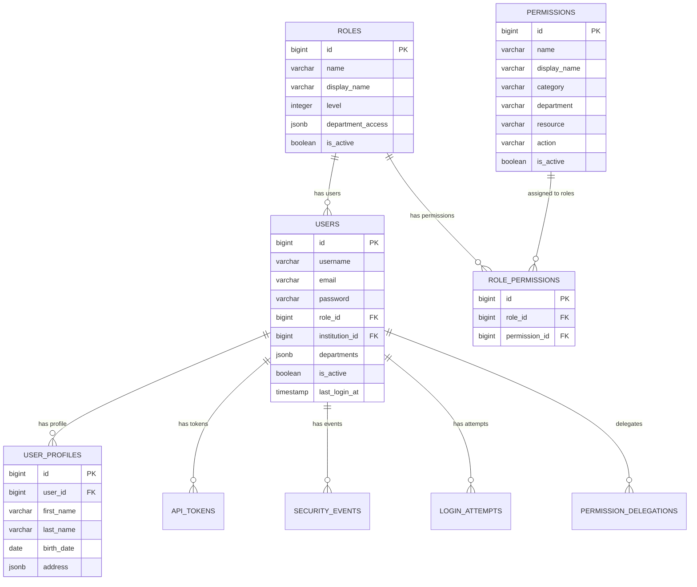

# DB-2: İstifadəçi və Səlahiyyət Cədvəlləri
## Azərbaycan Təhsil İdarəetmə Sistemi (ATİS)

### DOCUMENT INFO
**Version**: 2.1
**Created**: İyul 2025
**Category**: İstifadəçi İdarəetməsi və Təhlükəsizlik
**Technology**: PostgreSQL 15+ with Laravel 11 Migrations

---

## 1. İSTİFADƏÇİ İDARƏETMƏ SİSTEMİ

### 1.1 İstifadəçi Cədvəli (users)

```sql
CREATE TABLE users (
    id BIGSERIAL PRIMARY KEY,
    username VARCHAR(50) UNIQUE NOT NULL,
    email VARCHAR(100) UNIQUE,
    password VARCHAR(255) NOT NULL,
    role_id BIGINT NOT NULL,
    institution_id BIGINT,
    departments JSONB DEFAULT '[]'::jsonb, -- ['təhsil', 'statistika']
    is_active BOOLEAN DEFAULT true,
    last_login_at TIMESTAMP,
    password_changed_at TIMESTAMP DEFAULT NOW(),
    failed_login_attempts INTEGER DEFAULT 0,
    locked_until TIMESTAMP,
    email_verified_at TIMESTAMP,
    remember_token VARCHAR(100),
    created_at TIMESTAMP DEFAULT NOW(),
    updated_at TIMESTAMP DEFAULT NOW(),
    
    -- Constraints
    CONSTRAINT users_role_id_fkey FOREIGN KEY (role_id) REFERENCES roles(id),
    CONSTRAINT users_institution_id_fkey FOREIGN KEY (institution_id) REFERENCES institutions(id),
    CONSTRAINT users_username_length CHECK (length(username) >= 3),
    CONSTRAINT users_password_length CHECK (length(password) >= 8)
);

-- Indexes for users table
CREATE INDEX idx_users_username ON users(username);
CREATE INDEX idx_users_email ON users(email);
CREATE INDEX idx_users_role_institution ON users(role_id, institution_id);
CREATE INDEX idx_users_active_login ON users(is_active, last_login_at);
CREATE INDEX idx_users_departments_gin ON users USING GIN(departments);
```

**Sütun Təsvirləri**:

| Sütun                | Növ          | Təsvir                                            |
|---------------------|--------------|--------------------------------------------------|
| id                  | BIGSERIAL    | Unikal identifikator                              |
| username            | VARCHAR(50)  | İstifadəçi adı (unique)                           |
| email               | VARCHAR(100) | E-poçt ünvanı (unique)                            |
| password            | VARCHAR(255) | Hash-lənmiş şifrə                                 |
| role_id             | BIGINT       | İstifadəçi rolu                                   |
| institution_id      | BIGINT       | Bağlı olduğu təşkilat                             |
| departments         | JSONB        | Şöbə/departamentlər                               |
| is_active           | BOOLEAN      | Aktivlik statusu                                  |
| last_login_at       | TIMESTAMP    | Son giriş vaxtı                                   |
| password_changed_at | TIMESTAMP    | Şifrə dəyişdirilmə tarixi                         |
| failed_login_attempts | INTEGER    | Uğursuz giriş cəhdləri                            |
| locked_until        | TIMESTAMP    | Bloklanma müddəti (varsa)                         |
| email_verified_at   | TIMESTAMP    | E-poçt təsdiq olunma vaxtı                        |
| remember_token      | VARCHAR(100) | "Məni xatırla" tokeni                             |
| created_at          | TIMESTAMP    | Yaradılma vaxtı                                   |
| updated_at          | TIMESTAMP    | Son yenilənmə vaxtı                               |

**İstifadəçi Profilləri**:

```sql
CREATE TABLE user_profiles (
    id BIGSERIAL PRIMARY KEY,
    user_id BIGINT NOT NULL UNIQUE,
    first_name VARCHAR(100),
    last_name VARCHAR(100),
    patronymic VARCHAR(100),  -- Ata adı
    birth_date DATE,
    gender VARCHAR(10),
    national_id VARCHAR(20),  -- FIN/SSN
    profile_image_path VARCHAR(255),
    contact_phone VARCHAR(20),
    emergency_contact VARCHAR(20),
    address JSONB DEFAULT '{}'::jsonb,
    education_history JSONB DEFAULT '[]'::jsonb,
    employment_history JSONB DEFAULT '[]'::jsonb,
    certifications JSONB DEFAULT '[]'::jsonb,
    preferences JSONB DEFAULT '{}'::jsonb,
    created_at TIMESTAMP DEFAULT NOW(),
    updated_at TIMESTAMP DEFAULT NOW(),
    
    -- Constraints
    CONSTRAINT user_profiles_user_id_fkey FOREIGN KEY (user_id) REFERENCES users(id) ON DELETE CASCADE,
    CONSTRAINT user_profiles_gender_check CHECK (gender IN ('male', 'female', 'other'))
);

CREATE INDEX idx_user_profiles_names ON user_profiles(last_name, first_name);
CREATE INDEX idx_user_profiles_national_id ON user_profiles(national_id) WHERE national_id IS NOT NULL;
```

### 1.2 İstifadəçi Sessiyaları

```sql
CREATE TABLE sessions (
    id VARCHAR(255) PRIMARY KEY,
    user_id BIGINT,
    ip_address VARCHAR(45),
    user_agent TEXT,
    payload TEXT NOT NULL,
    last_activity INTEGER NOT NULL,
    
    -- Constraints
    CONSTRAINT sessions_user_id_fkey FOREIGN KEY (user_id) REFERENCES users(id) ON DELETE CASCADE
);

CREATE INDEX idx_sessions_user_id ON sessions(user_id);
CREATE INDEX idx_sessions_last_activity ON sessions(last_activity);
```

### 1.3 İstifadəçi Aktivlik Jurnalı

```sql
CREATE TABLE user_activity_logs (
    id BIGSERIAL PRIMARY KEY,
    user_id BIGINT NOT NULL,
    session_id VARCHAR(255),
    action VARCHAR(100) NOT NULL,
    entity_type VARCHAR(50),
    entity_id BIGINT,
    old_values JSONB,
    new_values JSONB,
    ip_address VARCHAR(45),
    user_agent TEXT,
    created_at TIMESTAMP DEFAULT NOW(),
    
    -- Constraints
    CONSTRAINT user_activity_logs_user_id_fkey FOREIGN KEY (user_id) REFERENCES users(id) ON DELETE CASCADE
);

CREATE INDEX idx_user_activity_logs_user_action ON user_activity_logs(user_id, action);
CREATE INDEX idx_user_activity_logs_entity ON user_activity_logs(entity_type, entity_id);
CREATE INDEX idx_user_activity_logs_created_at ON user_activity_logs(created_at);
```

---

## 2. ROL VƏ SƏLAHİYYƏT SİSTEMİ

### 2.1 Rollar Cədvəli (roles)

```sql
CREATE TABLE roles (
    id BIGSERIAL PRIMARY KEY,
    name VARCHAR(50) UNIQUE NOT NULL,
    display_name VARCHAR(100) NOT NULL,
    description TEXT,
    guard_name VARCHAR(50) DEFAULT 'web',
    level INTEGER NOT NULL, -- 1=SuperAdmin, 2=RegionAdmin, etc.
    department_access JSONB DEFAULT '[]'::jsonb, -- Available departments
    max_institutions INTEGER, -- null = unlimited
    is_active BOOLEAN DEFAULT true,
    created_at TIMESTAMP DEFAULT NOW(),
    updated_at TIMESTAMP DEFAULT NOW(),
    
    -- Constraints
    CONSTRAINT roles_level_range CHECK (level BETWEEN 1 AND 10),
    CONSTRAINT roles_name_format CHECK (name ~ '^[a-z_]+$')
);

-- Əsas rolların əlavə edilməsi
INSERT INTO roles (name, display_name, level, department_access) VALUES
('superadmin', 'Super Administrator', 1, '["maliyyə", "təsərrüfat", "təhsil", "statistika", "qiymətləndirmə"]'),
('regionadmin', 'Regional Administrator', 2, '["maliyyə", "təsərrüfat", "təhsil", "statistika", "qiymətləndirmə"]'),
('regionoperator', 'Regional Operator', 3, '["təhsil", "statistika"]'),
('sektoradmin', 'Sector Administrator', 4, '["təhsil", "statistika", "qiymətləndirmə"]'),
('schooladmin', 'School Administrator', 5, '["maliyyə", "təsərrüfat", "təhsil", "statistika", "qiymətləndirmə"]'),
('müavin_müdir', 'Assistant Principal', 5, '["təhsil", "statistika", "qiymətləndirmə"]'),
('ubr_müəllimi', 'Subject Teacher Leader', 6, '["təhsil", "qiymətləndirmə"]'),
('təsərrüfat_məsulu', 'Facility Manager', 6, '["təsərrüfat"]'),
('psixoloq', 'School Psychologist', 6, '["statistika", "qiymətləndirmə"]'),
('müəllim', 'Teacher', 7, '["təhsil", "qiymətləndirmə"]');
```

**Rol İerarxiyası**:

| Rol Adı | Səviyyə | Əlçatan Departamentlər | Təsvir |
|---------|---------|------------------------|--------|
| superadmin | 1 | Bütün | Sistemin tam idarə edilməsi |
| regionadmin | 2 | Bütün | Regional idarəetmə |
| regionoperator | 3 | Təhsil, Statistika | Regional əməliyyatlar |
| sektoradmin | 4 | Təhsil, Statistika, Qiymətləndirmə | Sektor idarəetməsi |
| schooladmin | 5 | Bütün | Məktəb idarəetməsi |
| müavin_müdir | 5 | Təhsil, Statistika, Qiymətləndirmə | Tədris işləri |
| ubr_müəllimi | 6 | Təhsil, Qiymətləndirmə | Fənn birləşmə rəhbəri |
| təsərrüfat_məsulu | 6 | Təsərrüfat | Məktəb təsərrüfatı |
| psixoloq | 6 | Statistika, Qiymətləndirmə | Psixoloji xidmət |
| müəllim | 7 | Təhsil, Qiymətləndirmə | Tədris fəaliyyəti |

### 2.2 Səlahiyyətlər Cədvəli (permissions)

```sql
CREATE TABLE permissions (
    id BIGSERIAL PRIMARY KEY,
    name VARCHAR(100) UNIQUE NOT NULL,
    display_name VARCHAR(150) NOT NULL,
    description TEXT,
    guard_name VARCHAR(50) DEFAULT 'web',
    category VARCHAR(50) NOT NULL, -- system, users, surveys, etc.
    department VARCHAR(50), -- null for system-wide permissions
    resource VARCHAR(50), -- table/model name
    action VARCHAR(50), -- create, read, update, delete, etc.
    is_active BOOLEAN DEFAULT true,
    created_at TIMESTAMP DEFAULT NOW(),
    updated_at TIMESTAMP DEFAULT NOW(),
    
    -- Constraints
    CONSTRAINT permissions_name_format CHECK (name ~ '^[a-z._]+$')
);

-- Əsas səlahiyyətlər
INSERT INTO permissions (name, display_name, category, resource, action) VALUES
-- İstifadəçi İdarəetməsi
('users.create', 'İstifadəçi yaratmaq', 'users', 'users', 'create'),
('users.read', 'İstifadəçiləri görmək', 'users', 'users', 'read'),
('users.update', 'İstifadəçi məlumatlarını dəyişmək', 'users', 'users', 'update'),
('users.delete', 'İstifadəçi silmək', 'users', 'users', 'delete'),

-- İnstitusiya İdarəetməsi  
('institutions.create', 'Təşkilat yaratmaq', 'institutions', 'institutions', 'create'),
('institutions.read', 'Təşkilatları görmək', 'institutions', 'institutions', 'read'),
('institutions.update', 'Təşkilat məlumatlarını dəyişmək', 'institutions', 'institutions', 'update'),

-- Sorğu İdarəetməsi
('surveys.create', 'Sorğu yaratmaq', 'surveys', 'surveys', 'create'),
('surveys.read', 'Sorğuları görmək', 'surveys', 'surveys', 'read'),
('surveys.respond', 'Sorğulara cavab vermək', 'surveys', 'surveys', 'respond'),
('surveys.approve', 'Sorğu cavablarını təsdiq etmək', 'surveys', 'survey_responses', 'approve'),

-- Akademik İdarəetmə (Departament: təhsil)
('schedules.create', 'Cədvəl yaratmaq', 'academics', 'schedules', 'create'),
('schedules.read', 'Cədvəlləri görmək', 'academics', 'schedules', 'read'),
('grades.create', 'Qiymət vermək', 'academics', 'student_grades', 'create'),
('grades.read', 'Qiymətləri görmək', 'academics', 'student_grades', 'read'),
('attendance.manage', 'Davamiyyəti idarə etmək', 'academics', 'student_attendance', 'manage');
```

### 2.3 Rol Səlahiyyətləri (role_permissions)

```sql
CREATE TABLE role_permissions (
    id BIGSERIAL PRIMARY KEY,
    role_id BIGINT NOT NULL,
    permission_id BIGINT NOT NULL,
    created_at TIMESTAMP DEFAULT NOW(),
    
    -- Constraints
    CONSTRAINT role_permissions_role_id_fkey FOREIGN KEY (role_id) REFERENCES roles(id) ON DELETE CASCADE,
    CONSTRAINT role_permissions_permission_id_fkey FOREIGN KEY (permission_id) REFERENCES permissions(id) ON DELETE CASCADE,
    CONSTRAINT role_permissions_unique UNIQUE(role_id, permission_id)
);

CREATE INDEX idx_role_permissions_role ON role_permissions(role_id);
```

### 2.4 Model Səlahiyyətləri

```sql
CREATE TABLE model_permissions (
    id BIGSERIAL PRIMARY KEY,
    permission_id BIGINT NOT NULL,
    model_type VARCHAR(100) NOT NULL,
    model_id BIGINT NOT NULL,
    user_id BIGINT NOT NULL,
    created_at TIMESTAMP DEFAULT NOW(),
    
    -- Constraints
    CONSTRAINT model_permissions_permission_id_fkey FOREIGN KEY (permission_id) REFERENCES permissions(id) ON DELETE CASCADE,
    CONSTRAINT model_permissions_user_id_fkey FOREIGN KEY (user_id) REFERENCES users(id) ON DELETE CASCADE,
    CONSTRAINT model_permissions_unique UNIQUE(permission_id, model_type, model_id, user_id)
);

CREATE INDEX idx_model_permissions_model ON model_permissions(model_type, model_id);
CREATE INDEX idx_model_permissions_user ON model_permissions(user_id);
```

---

## 3. AUTENTİFİKASİYA VƏ GİRİŞ SİSTEMİ

### 3.1 Şifrə Sıfırlama

```sql
CREATE TABLE password_resets (
    id BIGSERIAL PRIMARY KEY,
    email VARCHAR(100) NOT NULL,
    token VARCHAR(255) NOT NULL,
    created_at TIMESTAMP DEFAULT NOW(),
    expires_at TIMESTAMP NOT NULL,
    used BOOLEAN DEFAULT false,
    ip_address VARCHAR(45)
);

CREATE INDEX idx_password_resets_email ON password_resets(email);
CREATE INDEX idx_password_resets_token ON password_resets(token);
CREATE INDEX idx_password_resets_expires ON password_resets(expires_at, used) WHERE used = false;
```

### 3.2 İki Faktörlı Autentifikasiya

```sql
CREATE TABLE two_factor_auth (
    id BIGSERIAL PRIMARY KEY,
    user_id BIGINT NOT NULL UNIQUE,
    secret VARCHAR(255) NOT NULL,
    recovery_codes JSONB NOT NULL,
    enabled BOOLEAN DEFAULT false,
    confirmed_at TIMESTAMP,
    created_at TIMESTAMP DEFAULT NOW(),
    updated_at TIMESTAMP DEFAULT NOW(),
    
    -- Constraints
    CONSTRAINT two_factor_auth_user_id_fkey FOREIGN KEY (user_id) REFERENCES users(id) ON DELETE CASCADE
);
```

### 3.3 Səlahiyyət Delegasiyası (Müvəqqəti Səlahiyyət Ötürülməsi)

```sql
CREATE TABLE permission_delegations (
    id BIGSERIAL PRIMARY KEY,
    delegator_id BIGINT NOT NULL, -- delegated from
    delegatee_id BIGINT NOT NULL, -- delegated to
    role_id BIGINT, -- delegated role
    permissions JSONB, -- specific permissions
    reason TEXT,
    start_date TIMESTAMP NOT NULL,
    end_date TIMESTAMP NOT NULL,
    is_active BOOLEAN DEFAULT true,
    created_by BIGINT NOT NULL,
    created_at TIMESTAMP DEFAULT NOW(),
    updated_at TIMESTAMP DEFAULT NOW(),
    
    -- Constraints
    CONSTRAINT permission_delegations_delegator_id_fkey FOREIGN KEY (delegator_id) REFERENCES users(id),
    CONSTRAINT permission_delegations_delegatee_id_fkey FOREIGN KEY (delegatee_id) REFERENCES users(id),
    CONSTRAINT permission_delegations_role_id_fkey FOREIGN KEY (role_id) REFERENCES roles(id),
    CONSTRAINT permission_delegations_created_by_fkey FOREIGN KEY (created_by) REFERENCES users(id),
    CONSTRAINT permission_delegations_dates CHECK (end_date > start_date)
);

CREATE INDEX idx_permission_delegations_delegator ON permission_delegations(delegator_id);
CREATE INDEX idx_permission_delegations_delegatee ON permission_delegations(delegatee_id);
CREATE INDEX idx_permission_delegations_active_date ON permission_delegations(is_active, start_date, end_date);
```

---

## 4. ƏLAVƏ TƏHLÜKƏSİZLİK MEXANİZMLƏRİ

### 4.1 Giriş Cəhdləri Jurnalı

```sql
CREATE TABLE login_attempts (
    id BIGSERIAL PRIMARY KEY,
    username VARCHAR(50) NOT NULL,
    email VARCHAR(100),
    ip_address VARCHAR(45) NOT NULL,
    user_agent TEXT,
    success BOOLEAN NOT NULL,
    failure_reason VARCHAR(50),
    attempted_at TIMESTAMP DEFAULT NOW()
);

CREATE INDEX idx_login_attempts_username_ip ON login_attempts(username, ip_address);
CREATE INDEX idx_login_attempts_success ON login_attempts(success, attempted_at);
```

### 4.2 Təhlükəsizlik Hadisələri Jurnalı

```sql
CREATE TABLE security_events (
    id BIGSERIAL PRIMARY KEY,
    event_type VARCHAR(50) NOT NULL, -- 'password_change', 'role_change', etc.
    user_id BIGINT,
    affected_user_id BIGINT,
    details JSONB NOT NULL,
    ip_address VARCHAR(45),
    user_agent TEXT,
    created_at TIMESTAMP DEFAULT NOW(),
    
    -- Constraints
    CONSTRAINT security_events_user_id_fkey FOREIGN KEY (user_id) REFERENCES users(id) ON DELETE SET NULL,
    CONSTRAINT security_events_affected_user_id_fkey FOREIGN KEY (affected_user_id) REFERENCES users(id) ON DELETE SET NULL
);

CREATE INDEX idx_security_events_type ON security_events(event_type);
CREATE INDEX idx_security_events_user ON security_events(user_id) WHERE user_id IS NOT NULL;
CREATE INDEX idx_security_events_affected ON security_events(affected_user_id) WHERE affected_user_id IS NOT NULL;
CREATE INDEX idx_security_events_created ON security_events(created_at);
```

### 4.3 API Token Cədvəli

```sql
CREATE TABLE api_tokens (
    id BIGSERIAL PRIMARY KEY,
    user_id BIGINT NOT NULL,
    name VARCHAR(100) NOT NULL,
    token VARCHAR(255) NOT NULL,
    abilities JSONB DEFAULT '["*"]'::jsonb,
    last_used_at TIMESTAMP,
    expires_at TIMESTAMP,
    created_at TIMESTAMP DEFAULT NOW(),
    updated_at TIMESTAMP DEFAULT NOW(),
    
    -- Constraints
    CONSTRAINT api_tokens_user_id_fkey FOREIGN KEY (user_id) REFERENCES users(id) ON DELETE CASCADE
);

CREATE INDEX idx_api_tokens_token ON api_tokens(token);
CREATE INDEX idx_api_tokens_user_id ON api_tokens(user_id);
CREATE INDEX idx_api_tokens_expires_at ON api_tokens(expires_at);
```

---

## 5. ƏLAQƏLƏNDİRMƏ DİAQRAMI


