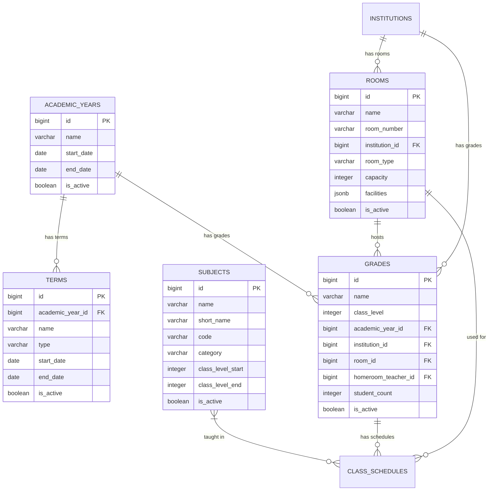

# DB-5A: Məktəb Akademik Strukturu
## Azərbaycan Təhsil İdarəetmə Sistemi (ATİS)

### DOCUMENT INFO
**Version**: 2.1
**Created**: İyul 2025
**Category**: Məktəb İdarəetməsi - Akademik Struktur
**Technology**: PostgreSQL 15+ with Laravel 11 Migrations

---

## 1. AKADEMİK STRUKTUR CƏDVƏLLƏRI

### 1.1 Tədris İlləri (academic_years)

```sql
CREATE TABLE academic_years (
    id BIGSERIAL PRIMARY KEY,
    name VARCHAR(100) NOT NULL,
    start_date DATE NOT NULL,
    end_date DATE NOT NULL,
    is_active BOOLEAN DEFAULT false,
    metadata JSONB DEFAULT '{}'::jsonb,
    created_at TIMESTAMP DEFAULT NOW(),
    updated_at TIMESTAMP DEFAULT NOW(),
    
    -- Constraints
    CONSTRAINT academic_years_dates_check CHECK (end_date > start_date),
    CONSTRAINT academic_years_name_unique UNIQUE (name)
);

CREATE INDEX idx_academic_years_dates ON academic_years(start_date, end_date);
CREATE INDEX idx_academic_years_active ON academic_years(is_active);
```

**Sütun Təsvirləri**:

| Sütun       | Növ          | Təsvir                    |
|-------------|--------------|---------------------------|
| id          | BIGSERIAL    | Unikal identifikator      |
| name        | VARCHAR(100) | Tədris ili adı (2025-2026)|
| start_date  | DATE         | Başlanğıc tarixi          |
| end_date    | DATE         | Bitmə tarixi              |
| is_active   | BOOLEAN      | Cari tədris ili           |
| metadata    | JSONB        | Əlavə məlumatlar          |

### 1.2 Semestr və Rüblər (terms)

```sql
CREATE TABLE terms (
    id BIGSERIAL PRIMARY KEY,
    academic_year_id BIGINT NOT NULL,
    name VARCHAR(100) NOT NULL,
    type VARCHAR(20) NOT NULL, -- 'semester', 'quarter'
    start_date DATE NOT NULL,
    end_date DATE NOT NULL,
    is_active BOOLEAN DEFAULT false,
    metadata JSONB DEFAULT '{}'::jsonb,
    created_at TIMESTAMP DEFAULT NOW(),
    updated_at TIMESTAMP DEFAULT NOW(),
    
    -- Constraints
    CONSTRAINT terms_academic_year_id_fkey FOREIGN KEY (academic_year_id) REFERENCES academic_years(id),
    CONSTRAINT terms_dates_check CHECK (end_date > start_date),
    CONSTRAINT terms_type_check CHECK (type IN ('semester', 'quarter')),
    CONSTRAINT terms_name_year_unique UNIQUE (name, academic_year_id)
);

CREATE INDEX idx_terms_academic_year ON terms(academic_year_id);
CREATE INDEX idx_terms_dates ON terms(start_date, end_date);
CREATE INDEX idx_terms_active ON terms(is_active);
```

### 1.3 Fənlər (subjects)

```sql
CREATE TABLE subjects (
    id BIGSERIAL PRIMARY KEY,
    name VARCHAR(150) NOT NULL,
    short_name VARCHAR(20),
    code VARCHAR(20) UNIQUE,
    category VARCHAR(50), -- 'science', 'humanities', 'language', etc.
    class_level_start INTEGER, -- Min class level (1-12)
    class_level_end INTEGER, -- Max class level (1-12)
    description TEXT,
    is_active BOOLEAN DEFAULT true,
    created_at TIMESTAMP DEFAULT NOW(),
    updated_at TIMESTAMP DEFAULT NOW(),
    
    -- Constraints
    CONSTRAINT subjects_class_level_range CHECK (class_level_start BETWEEN 1 AND 12),
    CONSTRAINT subjects_class_level_end_range CHECK (class_level_end BETWEEN 1 AND 12),
    CONSTRAINT subjects_class_level_check CHECK (class_level_end >= class_level_start)
);

CREATE INDEX idx_subjects_category ON subjects(category);
CREATE INDEX idx_subjects_class_level ON subjects(class_level_start, class_level_end);
CREATE INDEX idx_subjects_active ON subjects(is_active);
```

### 1.4 Siniflər (grades)

```sql
CREATE TABLE grades (
    id BIGSERIAL PRIMARY KEY,
    name VARCHAR(50) NOT NULL, -- '1A', '2B', '10C', etc.
    class_level INTEGER NOT NULL, -- 1-12
    academic_year_id BIGINT NOT NULL,
    institution_id BIGINT NOT NULL,
    room_id BIGINT,
    homeroom_teacher_id BIGINT,
    student_count INTEGER DEFAULT 0,
    specialty VARCHAR(100), -- 'math_focus', 'humanities', etc.
    metadata JSONB DEFAULT '{}'::jsonb,
    is_active BOOLEAN DEFAULT true,
    created_at TIMESTAMP DEFAULT NOW(),
    updated_at TIMESTAMP DEFAULT NOW(),
    
    -- Constraints
    CONSTRAINT grades_academic_year_id_fkey FOREIGN KEY (academic_year_id) REFERENCES academic_years(id),
    CONSTRAINT grades_institution_id_fkey FOREIGN KEY (institution_id) REFERENCES institutions(id),
    CONSTRAINT grades_room_id_fkey FOREIGN KEY (room_id) REFERENCES rooms(id),
    CONSTRAINT grades_homeroom_teacher_id_fkey FOREIGN KEY (homeroom_teacher_id) REFERENCES users(id),
    CONSTRAINT grades_class_level_range CHECK (class_level BETWEEN 1 AND 12),
    CONSTRAINT grades_name_year_school_unique UNIQUE (name, academic_year_id, institution_id)
);

CREATE INDEX idx_grades_institution ON grades(institution_id);
CREATE INDEX idx_grades_academic_year ON grades(academic_year_id);
CREATE INDEX idx_grades_homeroom_teacher ON grades(homeroom_teacher_id);
CREATE INDEX idx_grades_class_level ON grades(class_level);
CREATE INDEX idx_grades_active ON grades(is_active);
```

### 1.5 Sinif Otaqları (rooms)

```sql
CREATE TABLE rooms (
    id BIGSERIAL PRIMARY KEY,
    name VARCHAR(100) NOT NULL,
    room_number VARCHAR(20),
    institution_id BIGINT NOT NULL,
    building VARCHAR(50),
    floor INTEGER,
    room_type VARCHAR(50), -- 'classroom', 'lab', 'gym', 'library', etc.
    capacity INTEGER,
    facilities JSONB DEFAULT '[]'::jsonb, -- ['projector', 'whiteboard', 'computers']
    is_active BOOLEAN DEFAULT true,
    created_at TIMESTAMP DEFAULT NOW(),
    updated_at TIMESTAMP DEFAULT NOW(),
    
    -- Constraints
    CONSTRAINT rooms_institution_id_fkey FOREIGN KEY (institution_id) REFERENCES institutions(id),
    CONSTRAINT rooms_capacity_check CHECK (capacity > 0),
    CONSTRAINT rooms_number_institution_unique UNIQUE (room_number, institution_id)
);

CREATE INDEX idx_rooms_institution ON rooms(institution_id);
CREATE INDEX idx_rooms_type ON rooms(room_type);
CREATE INDEX idx_rooms_active ON rooms(is_active);
CREATE INDEX idx_rooms_facilities ON rooms USING GIN(facilities);
```

---

## 2. ƏLAQƏLƏNDİRMƏ DİAQRAMI (AKADEMİK STRUKTUR)


