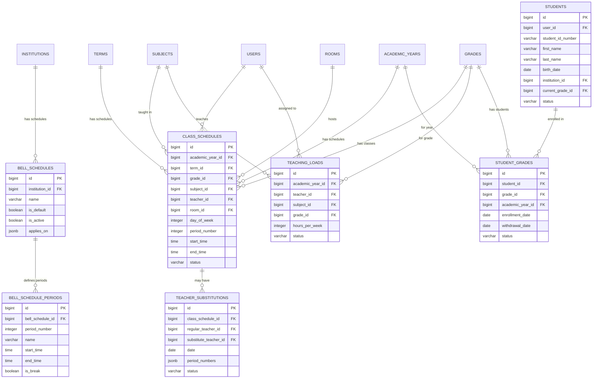

# DB-5B: Məktəb Dərs və Cədvəl Sistemi
## Azərbaycan Təhsil İdarəetmə Sistemi (ATİS)

### DOCUMENT INFO
**Version**: 2.1
**Created**: İyul 2025
**Category**: Məktəb İdarəetməsi - Dərs Cədvəli
**Technology**: PostgreSQL 15+ with Laravel 11 Migrations

---

## 1. DƏRS CƏDVƏLİ SİSTEMİ

### 1.1 Dərs Zəngi Cədvəlləri (bell_schedules)

```sql
CREATE TABLE bell_schedules (
    id BIGSERIAL PRIMARY KEY,
    institution_id BIGINT NOT NULL,
    name VARCHAR(100) NOT NULL,
    description TEXT,
    is_default BOOLEAN DEFAULT false,
    is_active BOOLEAN DEFAULT true,
    applies_on JSONB DEFAULT '["Monday", "Tuesday", "Wednesday", "Thursday", "Friday"]'::jsonb,
    created_at TIMESTAMP DEFAULT NOW(),
    updated_at TIMESTAMP DEFAULT NOW(),
    
    -- Constraints
    CONSTRAINT bell_schedules_institution_id_fkey FOREIGN KEY (institution_id) REFERENCES institutions(id)
);

CREATE INDEX idx_bell_schedules_institution ON bell_schedules(institution_id);
CREATE INDEX idx_bell_schedules_active ON bell_schedules(is_active);
```

### 1.2 Dərs Periodları (bell_schedule_periods)

```sql
CREATE TABLE bell_schedule_periods (
    id BIGSERIAL PRIMARY KEY,
    bell_schedule_id BIGINT NOT NULL,
    period_number INTEGER NOT NULL,
    name VARCHAR(50),
    start_time TIME NOT NULL,
    end_time TIME NOT NULL,
    is_break BOOLEAN DEFAULT false,
    break_type VARCHAR(20), -- 'lunch', 'recess', etc.
    created_at TIMESTAMP DEFAULT NOW(),
    updated_at TIMESTAMP DEFAULT NOW(),
    
    -- Constraints
    CONSTRAINT bell_schedule_periods_bell_schedule_id_fkey FOREIGN KEY (bell_schedule_id) REFERENCES bell_schedules(id) ON DELETE CASCADE,
    CONSTRAINT bell_schedule_periods_times_check CHECK (end_time > start_time),
    CONSTRAINT bell_schedule_periods_unique UNIQUE (bell_schedule_id, period_number)
);

CREATE INDEX idx_bell_schedule_periods_schedule ON bell_schedule_periods(bell_schedule_id);
```

### 1.3 Dərs Cədvəli (class_schedules)

```sql
CREATE TABLE class_schedules (
    id BIGSERIAL PRIMARY KEY,
    academic_year_id BIGINT NOT NULL,
    term_id BIGINT,
    institution_id BIGINT NOT NULL,
    grade_id BIGINT NOT NULL,
    subject_id BIGINT NOT NULL,
    teacher_id BIGINT NOT NULL,
    room_id BIGINT,
    day_of_week INTEGER NOT NULL, -- 1=Monday, 7=Sunday
    period_number INTEGER NOT NULL,
    start_time TIME NOT NULL,
    end_time TIME NOT NULL,
    is_repeating BOOLEAN DEFAULT true,
    effective_start_date DATE,
    effective_end_date DATE,
    status VARCHAR(20) DEFAULT 'active', -- 'active', 'cancelled', 'temporary'
    created_by BIGINT NOT NULL,
    created_at TIMESTAMP DEFAULT NOW(),
    updated_at TIMESTAMP DEFAULT NOW(),
    
    -- Constraints
    CONSTRAINT class_schedules_academic_year_id_fkey FOREIGN KEY (academic_year_id) REFERENCES academic_years(id),
    CONSTRAINT class_schedules_term_id_fkey FOREIGN KEY (term_id) REFERENCES terms(id),
    CONSTRAINT class_schedules_institution_id_fkey FOREIGN KEY (institution_id) REFERENCES institutions(id),
    CONSTRAINT class_schedules_grade_id_fkey FOREIGN KEY (grade_id) REFERENCES grades(id),
    CONSTRAINT class_schedules_subject_id_fkey FOREIGN KEY (subject_id) REFERENCES subjects(id),
    CONSTRAINT class_schedules_teacher_id_fkey FOREIGN KEY (teacher_id) REFERENCES users(id),
    CONSTRAINT class_schedules_room_id_fkey FOREIGN KEY (room_id) REFERENCES rooms(id),
    CONSTRAINT class_schedules_created_by_fkey FOREIGN KEY (created_by) REFERENCES users(id),
    CONSTRAINT class_schedules_day_of_week_check CHECK (day_of_week BETWEEN 1 AND 7),
    CONSTRAINT class_schedules_times_check CHECK (end_time > start_time),
    CONSTRAINT class_schedules_status_check CHECK (status IN ('active', 'cancelled', 'temporary'))
);

CREATE INDEX idx_class_schedules_institution ON class_schedules(institution_id);
CREATE INDEX idx_class_schedules_grade ON class_schedules(grade_id);
CREATE INDEX idx_class_schedules_teacher ON class_schedules(teacher_id);
CREATE INDEX idx_class_schedules_subject ON class_schedules(subject_id);
CREATE INDEX idx_class_schedules_academic_year ON class_schedules(academic_year_id);
CREATE INDEX idx_class_schedules_term ON class_schedules(term_id);
CREATE INDEX idx_class_schedules_day_period ON class_schedules(day_of_week, period_number);
CREATE INDEX idx_class_schedules_status ON class_schedules(status);
```

### 1.4 Dərs Yükü (teaching_loads)

```sql
CREATE TABLE teaching_loads (
    id BIGSERIAL PRIMARY KEY,
    academic_year_id BIGINT NOT NULL,
    term_id BIGINT,
    teacher_id BIGINT NOT NULL,
    subject_id BIGINT NOT NULL,
    grade_id BIGINT NOT NULL,
    hours_per_week INTEGER NOT NULL,
    max_hours_per_day INTEGER,
    preferred_days JSONB, -- [1, 3, 5] for Monday, Wednesday, Friday
    notes TEXT,
    status VARCHAR(20) DEFAULT 'active', -- 'active', 'completed', 'cancelled'
    assigned_by BIGINT NOT NULL,
    created_at TIMESTAMP DEFAULT NOW(),
    updated_at TIMESTAMP DEFAULT NOW(),
    
    -- Constraints
    CONSTRAINT teaching_loads_academic_year_id_fkey FOREIGN KEY (academic_year_id) REFERENCES academic_years(id),
    CONSTRAINT teaching_loads_term_id_fkey FOREIGN KEY (term_id) REFERENCES terms(id),
    CONSTRAINT teaching_loads_teacher_id_fkey FOREIGN KEY (teacher_id) REFERENCES users(id),
    CONSTRAINT teaching_loads_subject_id_fkey FOREIGN KEY (subject_id) REFERENCES subjects(id),
    CONSTRAINT teaching_loads_grade_id_fkey FOREIGN KEY (grade_id) REFERENCES grades(id),
    CONSTRAINT teaching_loads_assigned_by_fkey FOREIGN KEY (assigned_by) REFERENCES users(id),
    CONSTRAINT teaching_loads_hours_check CHECK (hours_per_week > 0),
    CONSTRAINT teaching_loads_unique UNIQUE (academic_year_id, term_id, teacher_id, subject_id, grade_id)
);

CREATE INDEX idx_teaching_loads_teacher ON teaching_loads(teacher_id);
CREATE INDEX idx_teaching_loads_academic_year ON teaching_loads(academic_year_id);
CREATE INDEX idx_teaching_loads_subject_grade ON teaching_loads(subject_id, grade_id);
CREATE INDEX idx_teaching_loads_status ON teaching_loads(status);
```

### 1.5 Dərs Əvəzetmələri (teacher_substitutions)

```sql
CREATE TABLE teacher_substitutions (
    id BIGSERIAL PRIMARY KEY,
    class_schedule_id BIGINT,
    regular_teacher_id BIGINT NOT NULL,
    substitute_teacher_id BIGINT NOT NULL,
    institution_id BIGINT NOT NULL,
    subject_id BIGINT,
    grade_id BIGINT,
    reason VARCHAR(100),
    notes TEXT,
    date DATE NOT NULL,
    period_numbers JSONB NOT NULL, -- [1, 2, 3] for 1st, 2nd, and 3rd periods
    status VARCHAR(20) DEFAULT 'scheduled', -- 'scheduled', 'completed', 'cancelled'
    approved_by BIGINT,
    approved_at TIMESTAMP,
    created_by BIGINT NOT NULL,
    created_at TIMESTAMP DEFAULT NOW(),
    updated_at TIMESTAMP DEFAULT NOW(),
    
    -- Constraints
    CONSTRAINT teacher_substitutions_class_schedule_id_fkey FOREIGN KEY (class_schedule_id) REFERENCES class_schedules(id),
    CONSTRAINT teacher_substitutions_regular_teacher_id_fkey FOREIGN KEY (regular_teacher_id) REFERENCES users(id),
    CONSTRAINT teacher_substitutions_substitute_teacher_id_fkey FOREIGN KEY (substitute_teacher_id) REFERENCES users(id),
    CONSTRAINT teacher_substitutions_institution_id_fkey FOREIGN KEY (institution_id) REFERENCES institutions(id),
    CONSTRAINT teacher_substitutions_subject_id_fkey FOREIGN KEY (subject_id) REFERENCES subjects(id),
    CONSTRAINT teacher_substitutions_grade_id_fkey FOREIGN KEY (grade_id) REFERENCES grades(id),
    CONSTRAINT teacher_substitutions_approved_by_fkey FOREIGN KEY (approved_by) REFERENCES users(id),
    CONSTRAINT teacher_substitutions_created_by_fkey FOREIGN KEY (created_by) REFERENCES users(id),
    CONSTRAINT teacher_substitutions_status_check CHECK (status IN ('scheduled', 'completed', 'cancelled')),
    CONSTRAINT teacher_substitutions_different_teachers CHECK (regular_teacher_id != substitute_teacher_id)
);

CREATE INDEX idx_teacher_substitutions_date ON teacher_substitutions(date);
CREATE INDEX idx_teacher_substitutions_regular_teacher ON teacher_substitutions(regular_teacher_id);
CREATE INDEX idx_teacher_substitutions_substitute_teacher ON teacher_substitutions(substitute_teacher_id);
CREATE INDEX idx_teacher_substitutions_institution ON teacher_substitutions(institution_id);
CREATE INDEX idx_teacher_substitutions_status ON teacher_substitutions(status);
CREATE INDEX idx_teacher_substitutions_periods ON teacher_substitutions USING GIN(period_numbers);
```

---

## 2. TƏHSİLALANLAR VƏ QEYDİYYAT SİSTEMİ

### 2.1 Şagirdlər (students)

```sql
CREATE TABLE students (
    id BIGSERIAL PRIMARY KEY,
    user_id BIGINT,
    student_id_number VARCHAR(20) UNIQUE,
    first_name VARCHAR(100) NOT NULL,
    last_name VARCHAR(100) NOT NULL,
    patronymic VARCHAR(100),
    birth_date DATE NOT NULL,
    gender VARCHAR(10) NOT NULL,
    national_id VARCHAR(20),
    institution_id BIGINT NOT NULL,
    current_grade_id BIGINT,
    entry_date DATE,
    graduation_date DATE,
    status VARCHAR(20) DEFAULT 'active', -- 'active', 'graduated', 'transferred', 'expelled', 'on_leave'
    enrollment_type VARCHAR(50) DEFAULT 'regular', -- 'regular', 'transfer', 'international'
    contact_info JSONB DEFAULT '{}'::jsonb,
    parents_info JSONB DEFAULT '[]'::jsonb,
    medical_info JSONB DEFAULT '{}'::jsonb,
    documents JSONB DEFAULT '[]'::jsonb,
    notes TEXT,
    created_at TIMESTAMP DEFAULT NOW(),
    updated_at TIMESTAMP DEFAULT NOW(),
    
    -- Constraints
    CONSTRAINT students_user_id_fkey FOREIGN KEY (user_id) REFERENCES users(id),
    CONSTRAINT students_institution_id_fkey FOREIGN KEY (institution_id) REFERENCES institutions(id),
    CONSTRAINT students_current_grade_id_fkey FOREIGN KEY (current_grade_id) REFERENCES grades(id),
    CONSTRAINT students_gender_check CHECK (gender IN ('male', 'female', 'other')),
    CONSTRAINT students_status_check CHECK (status IN ('active', 'graduated', 'transferred', 'expelled', 'on_leave')),
    CONSTRAINT students_dates_check CHECK (graduation_date IS NULL OR graduation_date > entry_date)
);

CREATE INDEX idx_students_institution ON students(institution_id);
CREATE INDEX idx_students_grade ON students(current_grade_id);
CREATE INDEX idx_students_status ON students(status);
CREATE INDEX idx_students_name ON students(last_name, first_name);
CREATE INDEX idx_students_birth_date ON students(birth_date);
CREATE INDEX idx_students_contact_info ON students USING GIN(contact_info);
CREATE INDEX idx_students_parents_info ON students USING GIN(parents_info);
```

### 2.2 Şagird-Sinif Əlaqəsi (student_grades)

```sql
CREATE TABLE student_grades (
    id BIGSERIAL PRIMARY KEY,
    student_id BIGINT NOT NULL,
    grade_id BIGINT NOT NULL,
    academic_year_id BIGINT NOT NULL,
    enrollment_date DATE NOT NULL,
    withdrawal_date DATE,
    status VARCHAR(20) DEFAULT 'active', -- 'active', 'completed', 'transferred', 'withdrawn'
    homeroom_teacher_id BIGINT,
    notes TEXT,
    created_at TIMESTAMP DEFAULT NOW(),
    updated_at TIMESTAMP DEFAULT NOW(),
    
    -- Constraints
    CONSTRAINT student_grades_student_id_fkey FOREIGN KEY (student_id) REFERENCES students(id),
    CONSTRAINT student_grades_grade_id_fkey FOREIGN KEY (grade_id) REFERENCES grades(id),
    CONSTRAINT student_grades_academic_year_id_fkey FOREIGN KEY (academic_year_id) REFERENCES academic_years(id),
    CONSTRAINT student_grades_homeroom_teacher_id_fkey FOREIGN KEY (homeroom_teacher_id) REFERENCES users(id),
    CONSTRAINT student_grades_status_check CHECK (status IN ('active', 'completed', 'transferred', 'withdrawn')),
    CONSTRAINT student_grades_unique UNIQUE (student_id, grade_id, academic_year_id)
);

CREATE INDEX idx_student_grades_student ON student_grades(student_id);
CREATE INDEX idx_student_grades_grade ON student_grades(grade_id);
CREATE INDEX idx_student_grades_academic_year ON student_grades(academic_year_id);
CREATE INDEX idx_student_grades_status ON student_grades(status);
CREATE INDEX idx_student_grades_homeroom_teacher ON student_grades(homeroom_teacher_id);
```

---

## 3. ƏLAQƏLƏNDİRMƏ DİAQRAMI (DƏRS CƏDVƏLİ SİSTEMİ)


