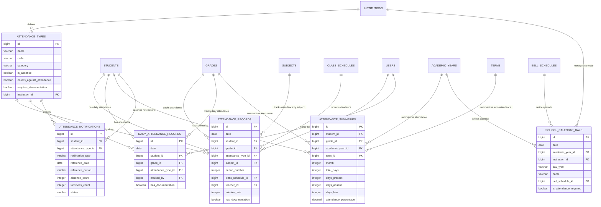

# DB-5C2: Məktəb Davamiyyət Sistemi
## Azərbaycan Təhsil İdarəetmə Sistemi (ATİS)

### DOCUMENT INFO
**Version**: 2.1
**Created**: İyul 2025
**Category**: Məktəb İdarəetməsi - Davamiyyət
**Technology**: PostgreSQL 15+ with Laravel 11 Migrations

---

## 1. DAVAMİYYƏT SİSTEMİ

### 1.1 Davamiyyət Növləri (attendance_types)

```sql
CREATE TABLE attendance_types (
    id BIGSERIAL PRIMARY KEY,
    name VARCHAR(100) NOT NULL,
    code VARCHAR(20) NOT NULL,
    short_name VARCHAR(5),
    description TEXT,
    category VARCHAR(20) NOT NULL, -- 'present', 'absent', 'late', 'excused'
    is_absence BOOLEAN DEFAULT false,
    counts_against_attendance BOOLEAN DEFAULT false,
    requires_documentation BOOLEAN DEFAULT false,
    color VARCHAR(7), -- Hex color code for UI display
    display_order INTEGER DEFAULT 0,
    institution_id BIGINT,
    is_system BOOLEAN DEFAULT false,
    created_at TIMESTAMP DEFAULT NOW(),
    updated_at TIMESTAMP DEFAULT NOW(),
    
    -- Constraints
    CONSTRAINT attendance_types_institution_id_fkey FOREIGN KEY (institution_id) REFERENCES institutions(id),
    CONSTRAINT attendance_types_category_check CHECK (category IN ('present', 'absent', 'late', 'excused')),
    CONSTRAINT attendance_types_code_unique UNIQUE (code, institution_id)
);

CREATE INDEX idx_attendance_types_institution ON attendance_types(institution_id);
CREATE INDEX idx_attendance_types_category ON attendance_types(category);
CREATE INDEX idx_attendance_types_is_system ON attendance_types(is_system);
```

### 1.2 Davamiyyət Qeydləri (attendance_records)

```sql
CREATE TABLE attendance_records (
    id BIGSERIAL PRIMARY KEY,
    date DATE NOT NULL,
    student_id BIGINT NOT NULL,
    grade_id BIGINT NOT NULL,
    attendance_type_id BIGINT NOT NULL,
    subject_id BIGINT,
    period_number INTEGER,
    class_schedule_id BIGINT,
    teacher_id BIGINT NOT NULL,
    minutes_late INTEGER,
    comment TEXT,
    has_documentation BOOLEAN DEFAULT false,
    documentation_notes TEXT,
    excused_by BIGINT,
    excused_at TIMESTAMP,
    is_modified BOOLEAN DEFAULT false,
    modified_by BIGINT,
    modified_at TIMESTAMP,
    created_at TIMESTAMP DEFAULT NOW(),
    updated_at TIMESTAMP DEFAULT NOW(),
    
    -- Constraints
    CONSTRAINT attendance_records_student_id_fkey FOREIGN KEY (student_id) REFERENCES students(id),
    CONSTRAINT attendance_records_grade_id_fkey FOREIGN KEY (grade_id) REFERENCES grades(id),
    CONSTRAINT attendance_records_attendance_type_id_fkey FOREIGN KEY (attendance_type_id) REFERENCES attendance_types(id),
    CONSTRAINT attendance_records_subject_id_fkey FOREIGN KEY (subject_id) REFERENCES subjects(id),
    CONSTRAINT attendance_records_class_schedule_id_fkey FOREIGN KEY (class_schedule_id) REFERENCES class_schedules(id),
    CONSTRAINT attendance_records_teacher_id_fkey FOREIGN KEY (teacher_id) REFERENCES users(id),
    CONSTRAINT attendance_records_excused_by_fkey FOREIGN KEY (excused_by) REFERENCES users(id),
    CONSTRAINT attendance_records_modified_by_fkey FOREIGN KEY (modified_by) REFERENCES users(id),
    CONSTRAINT attendance_records_minutes_late_check CHECK (minutes_late IS NULL OR minutes_late > 0),
    CONSTRAINT attendance_records_unique UNIQUE (date, student_id, subject_id, period_number)
);

CREATE INDEX idx_attendance_records_date ON attendance_records(date);
CREATE INDEX idx_attendance_records_student ON attendance_records(student_id);
CREATE INDEX idx_attendance_records_grade ON attendance_records(grade_id);
CREATE INDEX idx_attendance_records_type ON attendance_records(attendance_type_id);
CREATE INDEX idx_attendance_records_subject ON attendance_records(subject_id);
CREATE INDEX idx_attendance_records_teacher ON attendance_records(teacher_id);
CREATE INDEX idx_attendance_records_class_schedule ON attendance_records(class_schedule_id);
```

### 1.3 Gün Davamiyyət Qeydləri (daily_attendance_records)

```sql
CREATE TABLE daily_attendance_records (
    id BIGSERIAL PRIMARY KEY,
    date DATE NOT NULL,
    student_id BIGINT NOT NULL,
    grade_id BIGINT NOT NULL,
    attendance_type_id BIGINT NOT NULL,
    marked_by BIGINT NOT NULL,
    comment TEXT,
    has_documentation BOOLEAN DEFAULT false,
    documentation_notes TEXT,
    excused_by BIGINT,
    excused_at TIMESTAMP,
    is_modified BOOLEAN DEFAULT false,
    modified_by BIGINT,
    modified_at TIMESTAMP,
    created_at TIMESTAMP DEFAULT NOW(),
    updated_at TIMESTAMP DEFAULT NOW(),
    
    -- Constraints
    CONSTRAINT daily_attendance_records_student_id_fkey FOREIGN KEY (student_id) REFERENCES students(id),
    CONSTRAINT daily_attendance_records_grade_id_fkey FOREIGN KEY (grade_id) REFERENCES grades(id),
    CONSTRAINT daily_attendance_records_attendance_type_id_fkey FOREIGN KEY (attendance_type_id) REFERENCES attendance_types(id),
    CONSTRAINT daily_attendance_records_marked_by_fkey FOREIGN KEY (marked_by) REFERENCES users(id),
    CONSTRAINT daily_attendance_records_excused_by_fkey FOREIGN KEY (excused_by) REFERENCES users(id),
    CONSTRAINT daily_attendance_records_modified_by_fkey FOREIGN KEY (modified_by) REFERENCES users(id),
    CONSTRAINT daily_attendance_records_unique UNIQUE (date, student_id)
);

CREATE INDEX idx_daily_attendance_records_date ON daily_attendance_records(date);
CREATE INDEX idx_daily_attendance_records_student ON daily_attendance_records(student_id);
CREATE INDEX idx_daily_attendance_records_grade ON daily_attendance_records(grade_id);
CREATE INDEX idx_daily_attendance_records_type ON daily_attendance_records(attendance_type_id);
CREATE INDEX idx_daily_attendance_records_marked_by ON daily_attendance_records(marked_by);
```

### 1.4 Davamiyyət İcmalları (attendance_summaries)

```sql
CREATE TABLE attendance_summaries (
    id BIGSERIAL PRIMARY KEY,
    student_id BIGINT NOT NULL,
    grade_id BIGINT NOT NULL,
    academic_year_id BIGINT NOT NULL,
    term_id BIGINT,
    month INTEGER,
    total_days INTEGER NOT NULL DEFAULT 0,
    total_school_days INTEGER NOT NULL DEFAULT 0,
    days_present INTEGER NOT NULL DEFAULT 0,
    days_absent INTEGER NOT NULL DEFAULT 0,
    days_late INTEGER NOT NULL DEFAULT 0,
    days_excused INTEGER NOT NULL DEFAULT 0,
    periods_absent INTEGER NOT NULL DEFAULT 0,
    periods_late INTEGER NOT NULL DEFAULT 0,
    total_minutes_late INTEGER NOT NULL DEFAULT 0,
    attendance_percentage DECIMAL(5,2),
    generated_at TIMESTAMP NOT NULL,
    created_at TIMESTAMP DEFAULT NOW(),
    updated_at TIMESTAMP DEFAULT NOW(),
    
    -- Constraints
    CONSTRAINT attendance_summaries_student_id_fkey FOREIGN KEY (student_id) REFERENCES students(id),
    CONSTRAINT attendance_summaries_grade_id_fkey FOREIGN KEY (grade_id) REFERENCES grades(id),
    CONSTRAINT attendance_summaries_academic_year_id_fkey FOREIGN KEY (academic_year_id) REFERENCES academic_years(id),
    CONSTRAINT attendance_summaries_term_id_fkey FOREIGN KEY (term_id) REFERENCES terms(id),
    CONSTRAINT attendance_summaries_month_check CHECK (month BETWEEN 1 AND 12),
    CONSTRAINT attendance_summaries_unique UNIQUE (student_id, academic_year_id, term_id, month)
);

CREATE INDEX idx_attendance_summaries_student ON attendance_summaries(student_id);
CREATE INDEX idx_attendance_summaries_grade ON attendance_summaries(grade_id);
CREATE INDEX idx_attendance_summaries_academic_year ON attendance_summaries(academic_year_id);
CREATE INDEX idx_attendance_summaries_term ON attendance_summaries(term_id);
CREATE INDEX idx_attendance_summaries_month ON attendance_summaries(month);
```

### 1.5 Tədris Günləri Təqvimi (school_calendar_days)

```sql
CREATE TABLE school_calendar_days (
    id BIGSERIAL PRIMARY KEY,
    date DATE NOT NULL,
    academic_year_id BIGINT NOT NULL,
    institution_id BIGINT NOT NULL,
    day_type VARCHAR(20) NOT NULL, -- 'school_day', 'holiday', 'break', 'special_event'
    name VARCHAR(100),
    description TEXT,
    bell_schedule_id BIGINT,
    is_attendance_required BOOLEAN DEFAULT true,
    custom_settings JSONB DEFAULT '{}'::jsonb,
    created_at TIMESTAMP DEFAULT NOW(),
    updated_at TIMESTAMP DEFAULT NOW(),
    
    -- Constraints
    CONSTRAINT school_calendar_days_academic_year_id_fkey FOREIGN KEY (academic_year_id) REFERENCES academic_years(id),
    CONSTRAINT school_calendar_days_institution_id_fkey FOREIGN KEY (institution_id) REFERENCES institutions(id),
    CONSTRAINT school_calendar_days_bell_schedule_id_fkey FOREIGN KEY (bell_schedule_id) REFERENCES bell_schedules(id),
    CONSTRAINT school_calendar_days_day_type_check CHECK (day_type IN ('school_day', 'holiday', 'break', 'special_event')),
    CONSTRAINT school_calendar_days_unique UNIQUE (date, institution_id)
);

CREATE INDEX idx_school_calendar_days_date ON school_calendar_days(date);
CREATE INDEX idx_school_calendar_days_academic_year ON school_calendar_days(academic_year_id);
CREATE INDEX idx_school_calendar_days_institution ON school_calendar_days(institution_id);
CREATE INDEX idx_school_calendar_days_day_type ON school_calendar_days(day_type);
CREATE INDEX idx_school_calendar_days_attendance ON school_calendar_days(is_attendance_required);
```

### 1.6 Davamiyyət Bildirişləri (attendance_notifications)

```sql
CREATE TABLE attendance_notifications (
    id BIGSERIAL PRIMARY KEY,
    student_id BIGINT NOT NULL,
    attendance_type_id BIGINT NOT NULL,
    notification_type VARCHAR(50) NOT NULL, -- 'absence_warning', 'consecutive_absence', 'tardiness', 'attendance_improvement'
    reference_date DATE NOT NULL,
    reference_period VARCHAR(50), -- 'day', 'week', 'month', 'term', 'year'
    absence_count INTEGER,
    tardiness_count INTEGER,
    message TEXT,
    sent_to JSONB, -- Recipients (parents, guardians, administrators)
    sent_at TIMESTAMP,
    status VARCHAR(20) DEFAULT 'pending', -- 'pending', 'sent', 'delivered', 'failed'
    response_received BOOLEAN DEFAULT false,
    response_at TIMESTAMP,
    response_details JSONB DEFAULT '{}'::jsonb,
    created_at TIMESTAMP DEFAULT NOW(),
    updated_at TIMESTAMP DEFAULT NOW(),
    
    -- Constraints
    CONSTRAINT attendance_notifications_student_id_fkey FOREIGN KEY (student_id) REFERENCES students(id),
    CONSTRAINT attendance_notifications_attendance_type_id_fkey FOREIGN KEY (attendance_type_id) REFERENCES attendance_types(id),
    CONSTRAINT attendance_notifications_status_check CHECK (status IN ('pending', 'sent', 'delivered', 'failed'))
);

CREATE INDEX idx_attendance_notifications_student ON attendance_notifications(student_id);
CREATE INDEX idx_attendance_notifications_type ON attendance_notifications(notification_type);
CREATE INDEX idx_attendance_notifications_date ON attendance_notifications(reference_date);
CREATE INDEX idx_attendance_notifications_status ON attendance_notifications(status);
```

---

## 2. ƏLAQƏLƏNDİRMƏ DİAQRAMI (DAVAMİYYƏT SİSTEMİ)


