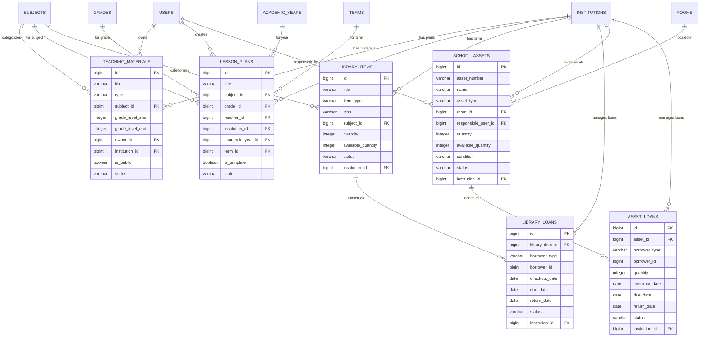

# DB-5D: Məktəb Resurslar və Materiallar
## Azərbaycan Təhsil İdarəetmə Sistemi (ATİS)

### DOCUMENT INFO
**Version**: 2.1
**Created**: İyul 2025
**Category**: Məktəb İdarəetməsi - Resurslar və Materiallar
**Technology**: PostgreSQL 15+ with Laravel 11 Migrations

---

## 1. TƏDRİS RESURSLARI VƏ MATERİALLARI

### 1.1 Tədris Materialları (teaching_materials)

```sql
CREATE TABLE teaching_materials (
    id BIGSERIAL PRIMARY KEY,
    title VARCHAR(200) NOT NULL,
    description TEXT,
    type VARCHAR(50) NOT NULL, -- 'lesson_plan', 'worksheet', 'presentation', 'quiz', 'video', 'document'
    subject_id BIGINT,
    grade_level_start INTEGER,
    grade_level_end INTEGER,
    owner_id BIGINT NOT NULL,
    institution_id BIGINT NOT NULL,
    is_public BOOLEAN DEFAULT false,
    file_path VARCHAR(255),
    file_size INTEGER,
    file_type VARCHAR(50),
    external_url VARCHAR(255),
    thumbnail_path VARCHAR(255),
    tags JSONB DEFAULT '[]'::jsonb,
    metadata JSONB DEFAULT '{}'::jsonb,
    view_count INTEGER DEFAULT 0,
    download_count INTEGER DEFAULT 0,
    status VARCHAR(20) DEFAULT 'active', -- 'draft', 'active', 'archived'
    created_at TIMESTAMP DEFAULT NOW(),
    updated_at TIMESTAMP DEFAULT NOW(),
    
    -- Constraints
    CONSTRAINT teaching_materials_subject_id_fkey FOREIGN KEY (subject_id) REFERENCES subjects(id),
    CONSTRAINT teaching_materials_owner_id_fkey FOREIGN KEY (owner_id) REFERENCES users(id),
    CONSTRAINT teaching_materials_institution_id_fkey FOREIGN KEY (institution_id) REFERENCES institutions(id),
    CONSTRAINT teaching_materials_grade_level_start_check CHECK (grade_level_start BETWEEN 1 AND 12),
    CONSTRAINT teaching_materials_grade_level_end_check CHECK (grade_level_end BETWEEN 1 AND 12),
    CONSTRAINT teaching_materials_grade_level_range_check CHECK (grade_level_end >= grade_level_start),
    CONSTRAINT teaching_materials_status_check CHECK (status IN ('draft', 'active', 'archived'))
);

CREATE INDEX idx_teaching_materials_subject ON teaching_materials(subject_id);
CREATE INDEX idx_teaching_materials_owner ON teaching_materials(owner_id);
CREATE INDEX idx_teaching_materials_institution ON teaching_materials(institution_id);
CREATE INDEX idx_teaching_materials_type ON teaching_materials(type);
CREATE INDEX idx_teaching_materials_grade_level ON teaching_materials(grade_level_start, grade_level_end);
CREATE INDEX idx_teaching_materials_status ON teaching_materials(status);
CREATE INDEX idx_teaching_materials_tags ON teaching_materials USING GIN(tags);
```

### 1.2 Dərs Planları (lesson_plans)

```sql
CREATE TABLE lesson_plans (
    id BIGSERIAL PRIMARY KEY,
    title VARCHAR(200) NOT NULL,
    description TEXT,
    subject_id BIGINT NOT NULL,
    grade_id BIGINT,
    grade_level INTEGER,
    teacher_id BIGINT NOT NULL,
    institution_id BIGINT NOT NULL,
    academic_year_id BIGINT,
    term_id BIGINT,
    unit_title VARCHAR(200),
    lesson_duration INTEGER, -- in minutes
    objectives TEXT,
    materials TEXT,
    procedure TEXT,
    assessment_methods TEXT,
    homework TEXT,
    standards_alignment JSONB DEFAULT '[]'::jsonb,
    attachments JSONB DEFAULT '[]'::jsonb,
    is_template BOOLEAN DEFAULT false,
    status VARCHAR(20) DEFAULT 'draft', -- 'draft', 'published', 'archived'
    approved_by BIGINT,
    approved_at TIMESTAMP,
    created_at TIMESTAMP DEFAULT NOW(),
    updated_at TIMESTAMP DEFAULT NOW(),
    
    -- Constraints
    CONSTRAINT lesson_plans_subject_id_fkey FOREIGN KEY (subject_id) REFERENCES subjects(id),
    CONSTRAINT lesson_plans_grade_id_fkey FOREIGN KEY (grade_id) REFERENCES grades(id),
    CONSTRAINT lesson_plans_teacher_id_fkey FOREIGN KEY (teacher_id) REFERENCES users(id),
    CONSTRAINT lesson_plans_institution_id_fkey FOREIGN KEY (institution_id) REFERENCES institutions(id),
    CONSTRAINT lesson_plans_academic_year_id_fkey FOREIGN KEY (academic_year_id) REFERENCES academic_years(id),
    CONSTRAINT lesson_plans_term_id_fkey FOREIGN KEY (term_id) REFERENCES terms(id),
    CONSTRAINT lesson_plans_approved_by_fkey FOREIGN KEY (approved_by) REFERENCES users(id),
    CONSTRAINT lesson_plans_grade_level_check CHECK (grade_level BETWEEN 1 AND 12),
    CONSTRAINT lesson_plans_status_check CHECK (status IN ('draft', 'published', 'archived'))
);

CREATE INDEX idx_lesson_plans_subject ON lesson_plans(subject_id);
CREATE INDEX idx_lesson_plans_grade ON lesson_plans(grade_id);
CREATE INDEX idx_lesson_plans_teacher ON lesson_plans(teacher_id);
CREATE INDEX idx_lesson_plans_institution ON lesson_plans(institution_id);
CREATE INDEX idx_lesson_plans_academic_year ON lesson_plans(academic_year_id);
CREATE INDEX idx_lesson_plans_term ON lesson_plans(term_id);
CREATE INDEX idx_lesson_plans_status ON lesson_plans(status);
CREATE INDEX idx_lesson_plans_template ON lesson_plans(is_template);
```

### 1.3 Kitabxana (library_items)

```sql
CREATE TABLE library_items (
    id BIGSERIAL PRIMARY KEY,
    title VARCHAR(200) NOT NULL,
    description TEXT,
    item_type VARCHAR(50) NOT NULL, -- 'book', 'journal', 'magazine', 'reference', 'multimedia', 'electronic'
    isbn VARCHAR(20),
    author VARCHAR(200),
    publisher VARCHAR(200),
    publication_year INTEGER,
    edition VARCHAR(50),
    subject_id BIGINT,
    grade_level_start INTEGER,
    grade_level_end INTEGER,
    language VARCHAR(50),
    location VARCHAR(100),
    call_number VARCHAR(50),
    barcode VARCHAR(50) UNIQUE,
    quantity INTEGER NOT NULL DEFAULT 1,
    available_quantity INTEGER NOT NULL DEFAULT 1,
    acquisition_date DATE,
    acquisition_method VARCHAR(50), -- 'purchase', 'donation', 'exchange'
    cost DECIMAL(10,2),
    donor VARCHAR(200),
    notes TEXT,
    status VARCHAR(20) DEFAULT 'available', -- 'available', 'on_loan', 'reserved', 'lost', 'damaged', 'discarded'
    institution_id BIGINT NOT NULL,
    created_at TIMESTAMP DEFAULT NOW(),
    updated_at TIMESTAMP DEFAULT NOW(),
    
    -- Constraints
    CONSTRAINT library_items_subject_id_fkey FOREIGN KEY (subject_id) REFERENCES subjects(id),
    CONSTRAINT library_items_institution_id_fkey FOREIGN KEY (institution_id) REFERENCES institutions(id),
    CONSTRAINT library_items_grade_level_start_check CHECK (grade_level_start BETWEEN 1 AND 12),
    CONSTRAINT library_items_grade_level_end_check CHECK (grade_level_end BETWEEN 1 AND 12),
    CONSTRAINT library_items_grade_level_range_check CHECK (grade_level_end >= grade_level_start),
    CONSTRAINT library_items_status_check CHECK (status IN ('available', 'on_loan', 'reserved', 'lost', 'damaged', 'discarded')),
    CONSTRAINT library_items_quantity_check CHECK (quantity > 0)
);

CREATE INDEX idx_library_items_title ON library_items(title);
CREATE INDEX idx_library_items_type ON library_items(item_type);
CREATE INDEX idx_library_items_isbn ON library_items(isbn);
CREATE INDEX idx_library_items_subject ON library_items(subject_id);
CREATE INDEX idx_library_items_status ON library_items(status);
CREATE INDEX idx_library_items_institution ON library_items(institution_id);
CREATE INDEX idx_library_items_barcode ON library_items(barcode);
```

### 1.4 Kitabxana Borc Qeydləri (library_loans)

```sql
CREATE TABLE library_loans (
    id BIGSERIAL PRIMARY KEY,
    library_item_id BIGINT NOT NULL,
    borrower_type VARCHAR(20) NOT NULL, -- 'student', 'teacher', 'staff'
    borrower_id BIGINT NOT NULL,
    checkout_date DATE NOT NULL,
    due_date DATE NOT NULL,
    return_date DATE,
    renewals_count INTEGER DEFAULT 0,
    status VARCHAR(20) DEFAULT 'checked_out', -- 'checked_out', 'returned', 'overdue', 'lost', 'damaged'
    fine_amount DECIMAL(10,2) DEFAULT 0.0,
    fine_paid BOOLEAN DEFAULT false,
    notes TEXT,
    checked_out_by BIGINT NOT NULL,
    checked_in_by BIGINT,
    institution_id BIGINT NOT NULL,
    created_at TIMESTAMP DEFAULT NOW(),
    updated_at TIMESTAMP DEFAULT NOW(),
    
    -- Constraints
    CONSTRAINT library_loans_library_item_id_fkey FOREIGN KEY (library_item_id) REFERENCES library_items(id),
    CONSTRAINT library_loans_borrower_type_check CHECK (borrower_type IN ('student', 'teacher', 'staff')),
    CONSTRAINT library_loans_checked_out_by_fkey FOREIGN KEY (checked_out_by) REFERENCES users(id),
    CONSTRAINT library_loans_checked_in_by_fkey FOREIGN KEY (checked_in_by) REFERENCES users(id),
    CONSTRAINT library_loans_institution_id_fkey FOREIGN KEY (institution_id) REFERENCES institutions(id),
    CONSTRAINT library_loans_dates_check CHECK (due_date >= checkout_date),
    CONSTRAINT library_loans_return_date_check CHECK (return_date IS NULL OR return_date >= checkout_date),
    CONSTRAINT library_loans_status_check CHECK (status IN ('checked_out', 'returned', 'overdue', 'lost', 'damaged'))
);

CREATE INDEX idx_library_loans_library_item ON library_loans(library_item_id);
CREATE INDEX idx_library_loans_borrower ON library_loans(borrower_type, borrower_id);
CREATE INDEX idx_library_loans_dates ON library_loans(checkout_date, due_date, return_date);
CREATE INDEX idx_library_loans_status ON library_loans(status);
CREATE INDEX idx_library_loans_institution ON library_loans(institution_id);
```

### 1.5 Məktəb İnventarı (school_assets)

```sql
CREATE TABLE school_assets (
    id BIGSERIAL PRIMARY KEY,
    asset_number VARCHAR(50) UNIQUE,
    name VARCHAR(200) NOT NULL,
    description TEXT,
    asset_type VARCHAR(50) NOT NULL, -- 'furniture', 'equipment', 'electronic', 'teaching_aid', 'sports'
    asset_category VARCHAR(100),
    manufacturer VARCHAR(100),
    model VARCHAR(100),
    serial_number VARCHAR(100),
    purchase_date DATE,
    purchase_price DECIMAL(10,2),
    supplier VARCHAR(100),
    warranty_expiration_date DATE,
    expected_lifetime INTEGER, -- in years
    location VARCHAR(100),
    room_id BIGINT,
    responsible_user_id BIGINT,
    quantity INTEGER NOT NULL DEFAULT 1,
    available_quantity INTEGER NOT NULL DEFAULT 1,
    condition VARCHAR(20) NOT NULL DEFAULT 'good', -- 'excellent', 'good', 'fair', 'poor', 'unusable'
    status VARCHAR(20) NOT NULL DEFAULT 'active', -- 'active', 'maintenance', 'loaned', 'retired', 'lost'
    last_maintenance_date DATE,
    next_maintenance_date DATE,
    notes TEXT,
    institution_id BIGINT NOT NULL,
    metadata JSONB DEFAULT '{}'::jsonb,
    created_at TIMESTAMP DEFAULT NOW(),
    updated_at TIMESTAMP DEFAULT NOW(),
    
    -- Constraints
    CONSTRAINT school_assets_room_id_fkey FOREIGN KEY (room_id) REFERENCES rooms(id),
    CONSTRAINT school_assets_responsible_user_id_fkey FOREIGN KEY (responsible_user_id) REFERENCES users(id),
    CONSTRAINT school_assets_institution_id_fkey FOREIGN KEY (institution_id) REFERENCES institutions(id),
    CONSTRAINT school_assets_condition_check CHECK (condition IN ('excellent', 'good', 'fair', 'poor', 'unusable')),
    CONSTRAINT school_assets_status_check CHECK (status IN ('active', 'maintenance', 'loaned', 'retired', 'lost')),
    CONSTRAINT school_assets_quantity_check CHECK (quantity > 0)
);

CREATE INDEX idx_school_assets_type ON school_assets(asset_type);
CREATE INDEX idx_school_assets_room ON school_assets(room_id);
CREATE INDEX idx_school_assets_institution ON school_assets(institution_id);
CREATE INDEX idx_school_assets_responsible_user ON school_assets(responsible_user_id);
CREATE INDEX idx_school_assets_status ON school_assets(status);
CREATE INDEX idx_school_assets_condition ON school_assets(condition);
CREATE INDEX idx_school_assets_number ON school_assets(asset_number);
```

### 1.6 İnventar Borc Qeydləri (asset_loans)

```sql
CREATE TABLE asset_loans (
    id BIGSERIAL PRIMARY KEY,
    asset_id BIGINT NOT NULL,
    borrower_type VARCHAR(20) NOT NULL, -- 'student', 'teacher', 'staff'
    borrower_id BIGINT NOT NULL,
    quantity INTEGER NOT NULL DEFAULT 1,
    checkout_date DATE NOT NULL,
    due_date DATE NOT NULL,
    return_date DATE,
    condition_at_checkout VARCHAR(20) NOT NULL, -- 'excellent', 'good', 'fair', 'poor'
    condition_at_return VARCHAR(20), -- 'excellent', 'good', 'fair', 'poor', 'damaged', 'lost'
    status VARCHAR(20) DEFAULT 'checked_out', -- 'checked_out', 'returned', 'overdue', 'lost', 'damaged'
    notes TEXT,
    authorized_by BIGINT NOT NULL,
    received_by BIGINT,
    institution_id BIGINT NOT NULL,
    created_at TIMESTAMP DEFAULT NOW(),
    updated_at TIMESTAMP DEFAULT NOW(),
    
    -- Constraints
    CONSTRAINT asset_loans_asset_id_fkey FOREIGN KEY (asset_id) REFERENCES school_assets(id),
    CONSTRAINT asset_loans_borrower_type_check CHECK (borrower_type IN ('student', 'teacher', 'staff')),
    CONSTRAINT asset_loans_authorized_by_fkey FOREIGN KEY (authorized_by) REFERENCES users(id),
    CONSTRAINT asset_loans_received_by_fkey FOREIGN KEY (received_by) REFERENCES users(id),
    CONSTRAINT asset_loans_institution_id_fkey FOREIGN KEY (institution_id) REFERENCES institutions(id),
    CONSTRAINT asset_loans_dates_check CHECK (due_date >= checkout_date),
    CONSTRAINT asset_loans_return_date_check CHECK (return_date IS NULL OR return_date >= checkout_date),
    CONSTRAINT asset_loans_status_check CHECK (status IN ('checked_out', 'returned', 'overdue', 'lost', 'damaged')),
    CONSTRAINT asset_loans_condition_at_checkout_check CHECK (condition_at_checkout IN ('excellent', 'good', 'fair', 'poor')),
    CONSTRAINT asset_loans_condition_at_return_check CHECK (condition_at_return IS NULL OR condition_at_return IN ('excellent', 'good', 'fair', 'poor', 'damaged', 'lost')),
    CONSTRAINT asset_loans_quantity_check CHECK (quantity > 0)
);

CREATE INDEX idx_asset_loans_asset ON asset_loans(asset_id);
CREATE INDEX idx_asset_loans_borrower ON asset_loans(borrower_type, borrower_id);
CREATE INDEX idx_asset_loans_dates ON asset_loans(checkout_date, due_date, return_date);
CREATE INDEX idx_asset_loans_status ON asset_loans(status);
CREATE INDEX idx_asset_loans_institution ON asset_loans(institution_id);
```

---

## 2. ƏLAQƏLƏNDİRMƏ DİAQRAMI (RESURSLAR VƏ MATERİALLAR)


